# Learning Through Equations

Welcome to the "Learning Through Equations" project, a collection of fundamental mathematical and scientific concepts aimed at helping parents and young children explore the world together. This repository is designed to introduce children to some of the most important equations that describe the natural world, from the flow of water and the movement of cars to the behavior of light and sound. Each equation is paired with a simple, hands-on experiment that illustrates its principles in a tangible and engaging way.

## Why This Project Matters

Children are naturally curious about the world around them. By tapping into this curiosity early, we can lay the groundwork for a lifelong interest in science and mathematics. This project demonstrates how mathematical equations are not just abstract concepts, but powerful tools that help us understand and predict the events happening all around us. By exposing children to these concepts at a young age, even in a simplified form, we can:

1. Demystify complex ideas and show that math is not just about numbers, but about understanding the world.
2. Illustrate how equations can explain everyday phenomena, from why objects fall to how light bends.
3. Introduce the concept of using known variables to predict outcomes, fostering critical thinking and problem-solving skills.
4. Build a familiarity with these foundational concepts, preparing children for more advanced studies in the future.

This approach is not about mastering the math right away but about sparking curiosity and showing how mathematics serves as a language to describe and predict the world around us.

## How to Use This Repository

Each section in this repository focuses on a specific equation, providing the following:

1. **Equation**: A fundamental mathematical formula or model that helps explain a real-world phenomenon.
2. **Experiment**: A simple, hands-on activity that demonstrates the principle behind the equation. These activities use everyday items, making them easy and fun to do at home or in the classroom.
3. **Explanation**: A child-friendly explanation of what the symbols in the equation mean and how they relate to the experiment.
4. **Importance**: A brief overview of why this equation is significant, its historical background, and its impact on science and technology.
5. **How to Explain to Kids**: A straightforward analogy or narrative to help children grasp the concept in a way that is relatable to their everyday experiences.
6. **Predictive Thinking**: Many activities ask learners to measure, compare, or estimate outcomes, encouraging children to think about cause-and-effect relationships.

## The Power of Learning Through Equations

Our world is shaped by the laws of physics, the principles of mathematics, and the wonders of natural phenomena. By engaging with these equations, children and their parents can:

1. Start to see patterns and relationships in the world around them.
2. Gain a deeper appreciation of how the world works.
3. Develop the ability to make predictions based on mathematical models.
4. Understand how scientists and engineers use these equations to solve real-world problems.
5. Nurture a sense of wonder and curiosity about the underlying principles that govern our universe.

Whether you're a parent looking for fun, educational activities to do with your child, a teacher seeking to enrich your science lessons, or simply someone interested in sharing the joy of learning, this repository offers valuable resources. Together, we can inspire the next generation of scientists, engineers, and mathematicians by making learning both fun and meaningful, and by showing how mathematics helps us unravel the mysteries of the world around us.

## Table of Contents 📖

- [Learning Through Equations](#learning-through-equations)
  - [Why This Project Matters](#why-this-project-matters)
  - [How to Use This Repository](#how-to-use-this-repository)
  - [The Power of Learning Through Equations](#the-power-of-learning-through-equations)
  - [Table of Contents 📖](#table-of-contents-)
  - [1. The Fundamental Theorem of Calculus](#1-the-fundamental-theorem-of-calculus)
    - [Experiment: Water Flowing from a Funnel into a Container](#experiment-water-flowing-from-a-funnel-into-a-container)
      - [Materials Needed](#materials-needed)
      - [Steps to Show the Math](#steps-to-show-the-math)
    - [What the Symbols Mean](#what-the-symbols-mean)
    - [Why This Equation is Important](#why-this-equation-is-important)
    - [Historical Example](#historical-example)
    - [How to Explain to Kids](#how-to-explain-to-kids)
  - [2. Newton's Second Law of Motion](#2-newtons-second-law-of-motion)
    - [Experiment: Toy Car Pulled by a Rubber Band](#experiment-toy-car-pulled-by-a-rubber-band)
      - [Materials Needed](#materials-needed-1)
      - [Steps to Show the Math](#steps-to-show-the-math-1)
    - [What the Symbols Mean](#what-the-symbols-mean-1)
    - [Why This Equation is Important](#why-this-equation-is-important-1)
    - [Historical Example](#historical-example-1)
    - [How to Explain to Kids](#how-to-explain-to-kids-1)
  - [3. The Ideal Gas Law](#3-the-ideal-gas-law)
    - [Experiment: Balloon Over a Bottle in Warm Water](#experiment-balloon-over-a-bottle-in-warm-water)
      - [Materials Needed](#materials-needed-2)
      - [Steps to Show the Math](#steps-to-show-the-math-2)
    - [What the Symbols Mean](#what-the-symbols-mean-2)
    - [Why This Equation is Important](#why-this-equation-is-important-2)
    - [Historical Example](#historical-example-2)
    - [How to Explain to Kids](#how-to-explain-to-kids-2)
  - [4. Ohm's Law](#4-ohms-law)
    - [Experiment: Circuit with a Battery, Resistor, and Variable Resistor](#experiment-circuit-with-a-battery-resistor-and-variable-resistor)
      - [Materials Needed](#materials-needed-3)
      - [Steps to Show the Math](#steps-to-show-the-math-3)
    - [What the Symbols Mean](#what-the-symbols-mean-3)
    - [Why This Equation is Important](#why-this-equation-is-important-3)
    - [Historical Example](#historical-example-3)
    - [How to Explain to Kids](#how-to-explain-to-kids-3)
  - [5. The Wave Equation](#5-the-wave-equation)
    - [Experiment: Waves on a Slinky](#experiment-waves-on-a-slinky)
      - [Materials Needed](#materials-needed-4)
      - [Steps to Show the Math](#steps-to-show-the-math-4)
    - [What the Symbols Mean](#what-the-symbols-mean-4)
    - [Why This Equation is Important](#why-this-equation-is-important-4)
    - [Historical Example](#historical-example-4)
    - [How to Explain to Kids](#how-to-explain-to-kids-4)
  - [6. Euler's Formula for Complex Exponentials](#6-eulers-formula-for-complex-exponentials)
    - [Experiment: Spinning Top or a Clock Face](#experiment-spinning-top-or-a-clock-face)
      - [Materials Needed](#materials-needed-5)
      - [Steps to Show the Math](#steps-to-show-the-math-5)
    - [What the Symbols Mean](#what-the-symbols-mean-5)
    - [Why This Equation is Important](#why-this-equation-is-important-5)
    - [Historical Example](#historical-example-5)
    - [How to Explain to Kids](#how-to-explain-to-kids-5)
  - [7. The Law of Universal Gravitation](#7-the-law-of-universal-gravitation)
    - [Experiment: Dropping Two Balls from the Same Height](#experiment-dropping-two-balls-from-the-same-height)
      - [Materials Needed](#materials-needed-6)
      - [Steps to Show the Math](#steps-to-show-the-math-6)
    - [What the Symbols Mean](#what-the-symbols-mean-6)
    - [Why This Equation is Important](#why-this-equation-is-important-6)
    - [Historical Example](#historical-example-6)
    - [How to Explain to Kids](#how-to-explain-to-kids-6)
  - [8. Navier-Stokes Equation (Simplified)](#8-navier-stokes-equation-simplified)
    - [Experiment: Stirring Water in a Bowl](#experiment-stirring-water-in-a-bowl)
      - [Materials Needed](#materials-needed-7)
      - [Steps to Show the Math](#steps-to-show-the-math-7)
    - [What the Symbols Mean](#what-the-symbols-mean-7)
    - [Why This Equation is Important](#why-this-equation-is-important-7)
    - [Historical Example](#historical-example-7)
    - [How to Explain to Kids](#how-to-explain-to-kids-7)
  - [9. The Normal Distribution (Gaussian Function)](#9-the-normal-distribution-gaussian-function)
    - [Experiment: Dropping Beads Through a Peg Board](#experiment-dropping-beads-through-a-peg-board)
      - [Materials Needed](#materials-needed-8)
      - [Steps to Show the Math](#steps-to-show-the-math-8)
    - [What the Symbols Mean](#what-the-symbols-mean-8)
    - [Why This Equation is Important](#why-this-equation-is-important-8)
    - [Historical Example](#historical-example-8)
    - [How to Explain to Kids](#how-to-explain-to-kids-8)
  - [10. Bayes' Theorem](#10-bayes-theorem)
    - [Experiment: Drawing Colored Candies from Two Bags](#experiment-drawing-colored-candies-from-two-bags)
      - [Materials Needed](#materials-needed-9)
      - [Steps to Show the Math](#steps-to-show-the-math-9)
    - [What the Symbols Mean](#what-the-symbols-mean-9)
    - [Why This Equation is Important](#why-this-equation-is-important-9)
    - [Historical Example](#historical-example-9)
    - [How to Explain to Kids](#how-to-explain-to-kids-9)
  - [11. The Second Law of Thermodynamics](#11-the-second-law-of-thermodynamics)
    - [Experiment: Melting Ice in a Warm Drink](#experiment-melting-ice-in-a-warm-drink)
      - [Materials Needed](#materials-needed-10)
      - [Steps to Show the Math](#steps-to-show-the-math-10)
    - [What the Symbols Mean](#what-the-symbols-mean-10)
    - [Why This Equation is Important](#why-this-equation-is-important-10)
    - [Historical Example](#historical-example-10)
    - [How to Explain to Kids](#how-to-explain-to-kids-10)
  - [12. Planck's Photon Energy Relation](#12-plancks-photon-energy-relation)
    - [Experiment: Flashlight with Colored Filters](#experiment-flashlight-with-colored-filters)
      - [Materials Needed](#materials-needed-11)
      - [Steps to Show the Math](#steps-to-show-the-math-11)
    - [What the Symbols Mean](#what-the-symbols-mean-11)
    - [Why This Equation is Important](#why-this-equation-is-important-11)
    - [Historical Example](#historical-example-11)
    - [How to Explain to Kids](#how-to-explain-to-kids-11)
  - [13. Coulomb's Law](#13-coulombs-law)
    - [Experiment: Rubbing Two Balloons with a Wool Sweater](#experiment-rubbing-two-balloons-with-a-wool-sweater)
      - [Materials Needed](#materials-needed-12)
      - [Steps to Show the Math](#steps-to-show-the-math-12)
    - [What the Symbols Mean](#what-the-symbols-mean-12)
    - [Why This Equation is Important](#why-this-equation-is-important-12)
    - [Historical Example](#historical-example-12)
    - [How to Explain to Kids](#how-to-explain-to-kids-12)
  - [14. The Logistic Growth Model](#14-the-logistic-growth-model)
    - [Experiment: Bean Population in a Limited Habitat](#experiment-bean-population-in-a-limited-habitat)
      - [Materials Needed](#materials-needed-13)
      - [Steps to Show the Math](#steps-to-show-the-math-13)
    - [What the Symbols Mean](#what-the-symbols-mean-13)
    - [Why This Equation is Important](#why-this-equation-is-important-13)
    - [Historical Example](#historical-example-13)
    - [How to Explain to Kids](#how-to-explain-to-kids-13)
  - [15. Kirchhoff's Current Law (KCL)](#15-kirchhoffs-current-law-kcl)
    - [Experiment: Using a Y-Shaped Water Pipe](#experiment-using-a-y-shaped-water-pipe)
      - [Materials Needed](#materials-needed-14)
      - [Steps to Show the Math](#steps-to-show-the-math-14)
    - [What the Symbols Mean](#what-the-symbols-mean-14)
    - [Why This Equation is Important](#why-this-equation-is-important-14)
    - [Historical Example](#historical-example-14)
    - [How to Explain to Kids](#how-to-explain-to-kids-14)
  - [16. Hooke's Law](#16-hookes-law)
    - [Experiment: Stretching a Spring](#experiment-stretching-a-spring)
      - [Materials Needed](#materials-needed-15)
      - [Steps to Show the Math](#steps-to-show-the-math-15)
    - [What the Symbols Mean](#what-the-symbols-mean-15)
    - [Why This Equation is Important](#why-this-equation-is-important-15)
    - [Historical Example](#historical-example-15)
    - [How to Explain to Kids](#how-to-explain-to-kids-15)
  - [17. The Pythagorean Theorem](#17-the-pythagorean-theorem)
    - [Experiment: Using a Right Triangle](#experiment-using-a-right-triangle)
      - [Materials Needed](#materials-needed-16)
      - [Steps to Show the Math](#steps-to-show-the-math-16)
    - [What the Symbols Mean](#what-the-symbols-mean-16)
    - [Why This Equation is Important](#why-this-equation-is-important-16)
    - [Historical Example](#historical-example-16)
    - [How to Explain to Kids](#how-to-explain-to-kids-16)
  - [18. Snell's Law](#18-snells-law)
    - [Experiment: Light Bending in Water](#experiment-light-bending-in-water)
      - [Materials Needed](#materials-needed-17)
      - [Steps to Show the Math](#steps-to-show-the-math-17)
    - [What the Symbols Mean](#what-the-symbols-mean-17)
    - [Why This Equation is Important](#why-this-equation-is-important-17)
    - [Historical Example](#historical-example-17)
    - [How to Explain to Kids](#how-to-explain-to-kids-17)
  - [19. Bernoulli's Equation](#19-bernoullis-equation)
    - [Experiment: Blowing Over Paper](#experiment-blowing-over-paper)
      - [Materials Needed](#materials-needed-18)
      - [Steps to Show the Math](#steps-to-show-the-math-18)
    - [What the Symbols Mean](#what-the-symbols-mean-18)
    - [Why This Equation is Important](#why-this-equation-is-important-18)
    - [Historical Example](#historical-example-18)
    - [How to Explain to Kids](#how-to-explain-to-kids-18)
  - [20. The Schrödinger Equation](#20-the-schrödinger-equation)
    - [Experiment: Waves in a Rope](#experiment-waves-in-a-rope)
      - [Materials Needed](#materials-needed-19)
      - [Steps to Show the Math](#steps-to-show-the-math-19)
    - [What the Symbols Mean](#what-the-symbols-mean-19)
    - [Why This Equation is Important](#why-this-equation-is-important-19)
    - [Historical Example](#historical-example-19)
    - [How to Explain to Kids](#how-to-explain-to-kids-19)
  - [21. Faraday's Law of Electromagnetic Induction](#21-faradays-law-of-electromagnetic-induction)
    - [Experiment: Moving a Magnet Near a Coil](#experiment-moving-a-magnet-near-a-coil)
      - [Materials Needed](#materials-needed-20)
      - [Steps to Show the Math](#steps-to-show-the-math-20)
    - [What the Symbols Mean](#what-the-symbols-mean-20)
    - [Why This Equation is Important](#why-this-equation-is-important-20)
    - [Historical Example](#historical-example-20)
    - [How to Explain to Kids](#how-to-explain-to-kids-20)
  - [22. The Doppler Effect Equation](#22-the-doppler-effect-equation)
    - [Experiment: Whistle and Running](#experiment-whistle-and-running)
      - [Materials Needed](#materials-needed-21)
      - [Steps to Show the Math](#steps-to-show-the-math-21)
    - [What the Symbols Mean](#what-the-symbols-mean-21)
    - [Why This Equation is Important](#why-this-equation-is-important-21)
    - [Historical Example](#historical-example-21)
    - [How to Explain to Kids](#how-to-explain-to-kids-21)
  - [23. The Heisenberg Uncertainty Principle](#23-the-heisenberg-uncertainty-principle)
    - [Experiment: Throwing a Ball in the Dark](#experiment-throwing-a-ball-in-the-dark)
      - [Materials Needed](#materials-needed-22)
      - [Steps to Show the Math](#steps-to-show-the-math-22)
    - [What the Symbols Mean](#what-the-symbols-mean-22)
    - [Why This Equation is Important](#why-this-equation-is-important-22)
    - [Historical Example](#historical-example-22)
    - [How to Explain to Kids](#how-to-explain-to-kids-22)
  - [24. The Lorentz Transformation](#24-the-lorentz-transformation)
    - [Experiment: Watching a Moving Object](#experiment-watching-a-moving-object)
      - [Materials Needed](#materials-needed-23)
      - [Steps to Show the Math](#steps-to-show-the-math-23)
    - [What the Symbols Mean](#what-the-symbols-mean-23)
    - [Why This Equation is Important](#why-this-equation-is-important-23)
    - [Historical Example](#historical-example-23)
    - [How to Explain to Kids](#how-to-explain-to-kids-23)
  - [25. Fourier Transform](#25-fourier-transform)
    - [Experiment: Sound Waves and Frequencies](#experiment-sound-waves-and-frequencies)
      - [Materials Needed](#materials-needed-24)
      - [Steps to Show the Math](#steps-to-show-the-math-24)
    - [What the Symbols Mean](#what-the-symbols-mean-24)
    - [Why This Equation is Important](#why-this-equation-is-important-24)
    - [Historical Example](#historical-example-24)
    - [How to Explain to Kids](#how-to-explain-to-kids-24)
  - [26. The Stefan-Boltzmann Law](#26-the-stefan-boltzmann-law)
    - [Experiment: Observing Heat from Different Light Bulbs](#experiment-observing-heat-from-different-light-bulbs)
      - [Materials Needed](#materials-needed-25)
      - [Steps to Show the Math](#steps-to-show-the-math-25)
    - [What the Symbols Mean](#what-the-symbols-mean-25)
    - [Why This Equation is Important](#why-this-equation-is-important-25)
    - [Historical Example](#historical-example-25)
    - [How to Explain to Kids](#how-to-explain-to-kids-25)
  - [27. The Schrödinger Wave Equation (Time-Independent Form)](#27-the-schrödinger-wave-equation-time-independent-form)
    - [Experiment: Standing Waves on a String](#experiment-standing-waves-on-a-string)
      - [Materials Needed](#materials-needed-26)
      - [Steps to Show the Math](#steps-to-show-the-math-26)
    - [What the Symbols Mean](#what-the-symbols-mean-26)
    - [Why This Equation is Important](#why-this-equation-is-important-26)
    - [Historical Example](#historical-example-26)
    - [How to Explain to Kids](#how-to-explain-to-kids-26)
  - [28. The Nernst Equation](#28-the-nernst-equation)
    - [Experiment: Lemon Battery](#experiment-lemon-battery)
      - [Materials Needed](#materials-needed-27)
      - [Steps to Show the Math](#steps-to-show-the-math-27)
    - [What the Symbols Mean](#what-the-symbols-mean-27)
    - [Why This Equation is Important](#why-this-equation-is-important-27)
    - [Historical Example](#historical-example-27)
    - [How to Explain to Kids](#how-to-explain-to-kids-27)
  - [29. The Black-Scholes Equation](#29-the-black-scholes-equation)
    - [Experiment: Stock Market Simulation Game](#experiment-stock-market-simulation-game)
      - [Materials Needed](#materials-needed-28)
      - [Steps to Show the Math](#steps-to-show-the-math-28)
    - [What the Symbols Mean](#what-the-symbols-mean-28)
    - [Why This Equation is Important](#why-this-equation-is-important-28)
    - [Historical Example](#historical-example-28)
    - [How to Explain to Kids](#how-to-explain-to-kids-28)
  - [30. Maxwell's Equations (Differential Form)](#30-maxwells-equations-differential-form)
    - [Experiment: Electromagnet and Compass](#experiment-electromagnet-and-compass)
      - [Materials Needed](#materials-needed-29)
      - [Steps to Show the Math](#steps-to-show-the-math-29)
    - [What the Symbols Mean](#what-the-symbols-mean-29)
    - [Why This Equation is Important](#why-this-equation-is-important-29)
    - [Historical Example](#historical-example-29)
    - [How to Explain to Kids](#how-to-explain-to-kids-29)
  - [31. The Conservation of Momentum](#31-the-conservation-of-momentum)
    - [Experiment: Rolling Marbles on a Smooth Surface](#experiment-rolling-marbles-on-a-smooth-surface)
      - [Materials Needed](#materials-needed-30)
      - [Steps to Show the Math](#steps-to-show-the-math-30)
    - [What the Symbols Mean](#what-the-symbols-mean-30)
    - [Why This Equation is Important](#why-this-equation-is-important-30)
    - [Historical Example](#historical-example-30)
    - [How to Explain to Kids](#how-to-explain-to-kids-30)
  - [32. The Law of Refraction (Snell's Law)](#32-the-law-of-refraction-snells-law)
    - [Experiment: Laser Pointer in Water](#experiment-laser-pointer-in-water)
      - [Materials Needed](#materials-needed-31)
      - [Steps to Show the Math](#steps-to-show-the-math-31)
    - [What the Symbols Mean](#what-the-symbols-mean-31)
    - [Why This Equation is Important](#why-this-equation-is-important-31)
    - [Historical Example](#historical-example-31)
    - [How to Explain to Kids](#how-to-explain-to-kids-31)
  - [33. The Continuity Equation in Fluid Dynamics](#33-the-continuity-equation-in-fluid-dynamics)
    - [Experiment: Squeezing a Water Hose](#experiment-squeezing-a-water-hose)
      - [Materials Needed](#materials-needed-32)
      - [Steps to Show the Math](#steps-to-show-the-math-32)
    - [What the Symbols Mean](#what-the-symbols-mean-32)
    - [Why This Equation is Important](#why-this-equation-is-important-32)
    - [Historical Example](#historical-example-32)
    - [How to Explain to Kids](#how-to-explain-to-kids-32)
  - [34. The Gravitational Potential Energy](#34-the-gravitational-potential-energy)
    - [Experiment: Dropping Objects from Different Heights](#experiment-dropping-objects-from-different-heights)
      - [Materials Needed](#materials-needed-33)
      - [Steps to Show the Math](#steps-to-show-the-math-33)
    - [What the Symbols Mean](#what-the-symbols-mean-33)
    - [Why This Equation is Important](#why-this-equation-is-important-33)
    - [Historical Example](#historical-example-33)
    - [How to Explain to Kids](#how-to-explain-to-kids-33)
  - [35. The Ideal Gas Law (Revisited with Temperature)](#35-the-ideal-gas-law-revisited-with-temperature)
    - [Experiment: Inflating a Balloon in Hot and Cold Water](#experiment-inflating-a-balloon-in-hot-and-cold-water)
      - [Materials Needed](#materials-needed-34)
      - [Steps to Show the Math](#steps-to-show-the-math-34)
    - [What the Symbols Mean](#what-the-symbols-mean-34)
    - [Why This Equation is Important](#why-this-equation-is-important-34)
    - [Historical Example](#historical-example-34)
    - [How to Explain to Kids](#how-to-explain-to-kids-34)

## 1. The Fundamental Theorem of Calculus

$$
\frac{d}{dx} \int_a^x f(t) \, dt = f(x)
$$

### Experiment: Water Flowing from a Funnel into a Container

#### Materials Needed

- Funnel
- Large container (like a measuring jug)
- Small cup (e.g., 10 ml or 50 ml)
- Stopwatch
- Water

#### Steps to Show the Math

1. **Set Up:** Place the funnel over the large container. Make sure the container is stable to avoid spills.
2. **Measure Flow Rate:** 
   - Start with a small amount of water in the funnel. Place the small cup under the funnel's spout.
   - Use the stopwatch to measure the time it takes to fill the small cup (e.g., 10 seconds for 10 ml, meaning the average flow rate is 1 ml/sec). Try to keep the water level in the funnel steady, because the flow rate can change as the funnel empties.
3. **Calculate Total Water (Integration):**
   - Predict the total water collected in the large container after 1 minute using the flow rate.
   - For example, if the flow rate is 1 ml/sec, then in 60 seconds, the total water should be $1 \times 60 = 60$ ml.
4. **Direct Measurement:** Allow water to flow for 1 minute, then measure the actual water collected in the container.
5. **Explanation:** Explain that the total amount of water collected (integral) is found by adding up small amounts of water over time. The flow rate (derivative) tells how fast water is flowing at any moment.

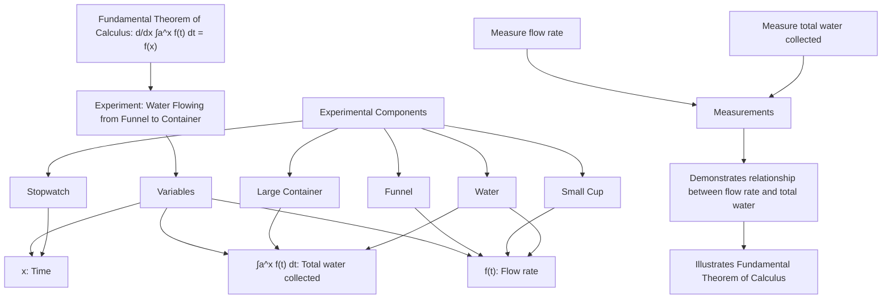

### What the Symbols Mean

- **$\int_a^x f(t) \, dt$:** The integral represents adding up all the tiny pieces of a quantity from point $a$ to point $x$, like summing up the small amounts of water over time.
- **$\frac{d}{dx}$:** The derivative measures how something is changing at a specific point. It’s like asking, "How fast is the water flowing right now?"
- **$f(t)$:** The function that describes the flow rate of water over time.
- **$f(x)$:** The value of the function at a specific point $x$, telling us the flow rate at that moment.

### Why This Equation is Important

- The Fundamental Theorem of Calculus connects two major concepts in mathematics: differentiation and integration. This connection allows us to calculate areas and volumes and solve real-world problems involving rates of change, such as speed and growth.

### Historical Example

- Isaac Newton and Gottfried Wilhelm Leibniz independently developed calculus in the late 17th century. This theorem has since been crucial in understanding motion, area, and growth, making it fundamental to modern science and engineering.

### How to Explain to Kids

- “When we collect water in a cup over time, we can add up all the little drops to find out how much water we have. That’s what integration does. If we want to know how fast the water is coming out right now, we use the derivative.”

---

## 2. Newton's Second Law of Motion

$$
F = ma
$$

### Experiment: Toy Car Pulled by a Rubber Band

#### Materials Needed

- Toy car
- Rubber band
- Small weights (like coins or small bags of rice)
- Tape
- Stopwatch
- Measuring tape or ruler
- Spring scale (optional)

#### Steps to Show the Math

1. **Set Up:** Tape a rubber band to the front of the toy car. Mark a start line and finish line on a smooth floor.
2. **Measure Car Mass:** Weigh the toy car using a kitchen scale. Note its mass (e.g., 0.5 kg). Add coins or small weights for additional trials.
3. **Calculate Acceleration:**
   - Stretch the rubber band to the same marked length each time and release the car. Use the stopwatch to measure the time it takes to reach the finish line.
   - Calculate acceleration using the formula:  
     `acceleration = change in velocity / time`  
     If the car starts from rest and the acceleration is roughly constant, estimate it with `a = 2 * distance / time^2`.
4. **Calculate Force:**
   - If you have a spring scale, measure the pull when the rubber band is stretched to the mark.
   - Use the equation:  
     `F = ma`  
     For instance, with mass `0.5 kg` and acceleration `2 m/s^2`:  
     `F = 0.5 * 2 = 1 N`
5. **Explanation:** Discuss how the same pull gives less acceleration when the car has more mass, and how a stronger pull gives more acceleration for the same car. Friction and the rubber band's changing pull make the result approximate, but the trend illustrates $F = ma$.

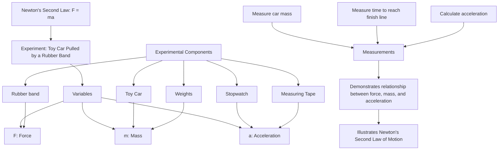

### What the Symbols Mean

- **F:** Force, the push or pull on an object, measured in newtons (N).
- **m:** Mass of the object, measured in kilograms (kg). It tells how much matter the car has, while weight is the gravitational force on that mass.
- **a:** Acceleration, measured in meters per second squared (m/s^2). It tells us how quickly the speed of the car is changing.

### Why This Equation is Important

Newton's Second Law of Motion is one of the fundamental principles of classical mechanics, explaining how the motion of an object changes when it is subjected to forces. It allows us to predict the behavior of objects under various forces, which is crucial in engineering, physics, and everyday life, such as understanding car safety, rocket launches, and sporting dynamics.

### Historical Example

Formulated by Sir Isaac Newton in the late 17th century, this law was a part of his groundbreaking work "Philosophiæ Naturalis Principia Mathematica." Newton's laws revolutionized science by providing a unified framework for understanding the motion of objects on Earth and in the heavens.

### How to Explain to Kids

“If you push a toy car, it goes faster. If you add more weight, you have to push harder to make it go the same speed. This law tells us how things move when we push or pull them.”

---

## 3. The Ideal Gas Law

$$
PV = nRT
$$

### Experiment: Balloon Over a Bottle in Warm Water

#### Materials Needed

- Small balloon
- Bottle (glass or plastic)
- Warm water
- Measuring tape
- Thermometer

#### Steps to Show the Math

1. **Set Up:** Stretch the balloon over the bottle's opening. Ensure it's sealed tightly.
2. **Measure Initial Balloon Volume:** Measure the balloon’s circumference while at room temperature to estimate its volume.
3. **Change Temperature:** Place the bottle in a bowl of warm water. Observe the balloon inflating as the temperature rises.
4. **Measure New Volume:** Measure the balloon’s circumference again to estimate the increased volume.
5. **Explanation:** Explain that warming the air inside the bottle makes it expand, filling the balloon. Relate this to the Ideal Gas Law: when the amount of gas is fixed and pressure is roughly constant, volume increases with absolute temperature.

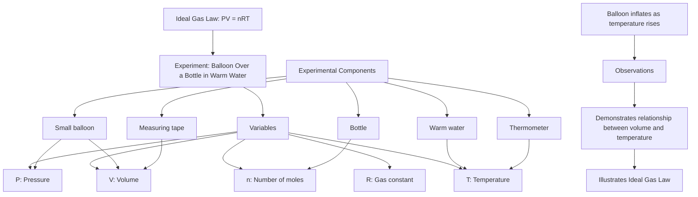

### What the Symbols Mean

- **$P$:** Pressure of the gas, measured in atmospheres (atm) or pascals (Pa). It’s like how much the gas is pushing against the balloon.
- **$V$:** Volume of the gas, measured in liters (L) or cubic meters (m\(^3\)). It’s the space the gas takes up.
- **$n$:** Number of moles of gas, which is a way to count how many gas particles there are.
- **$R$:** Gas constant, a fixed number ($8.314 \, \text{J/(mol·K)}$) that relates the other units.
- **$T$:** Temperature of the gas, measured in kelvin (K). It’s how hot the gas is.

### Why This Equation is Important

- The Ideal Gas Law helps us understand and predict the behavior of gases under different conditions. It's crucial in fields like chemistry, physics, and engineering for processes like chemical reactions and engine operations.

### Historical Example

- Developed over time by scientists like Robert Boyle, Jacques Charles, and Amedeo Avogadro, this law became essential in the 19th century. It helped chemists understand how gases behave and how they could be used in various applications, from balloons to industrial processes.

### How to Explain to Kids

- “When you warm up the gas in the bottle, it makes the gas molecules move faster and push out more, so the balloon gets bigger. The equation shows how pressure, volume, and temperature are related. If one changes, the others change too.”

---

## 4. Ohm's Law

$$
V = IR
$$

### Experiment: Circuit with a Battery, Resistor, and Variable Resistor

#### Materials Needed

- Battery (9V)
- Fixed resistor (for example, 330 Ω or 1 kΩ)
- Variable resistor or potentiometer
- Small LED (optional, with the fixed resistor in series)
- Multimeter
- Wires and connectors

#### Steps to Show the Math

1. **Set Up:** Connect the battery, fixed resistor, and variable resistor in series. If using an LED, keep the fixed resistor in series to limit current.
2. **Measure Voltage:** Use the multimeter to measure the voltage across the fixed resistor.
3. **Measure Current:** Measure the current through the circuit by placing the multimeter in series.
4. **Calculate Resistance:** Use Ohm’s law for the fixed resistor using the formula:
   `R = V / I`  
   For example, with `3V` and `0.003A`:
   `R = 3 / 0.003 = 1000 Ω`
5. **Explanation:** Show how changing the variable resistor changes the current. Explain that Ohm's law works best for ohmic components, such as many fixed resistors, when temperature is roughly constant; light bulbs and LEDs do not follow it as simply.

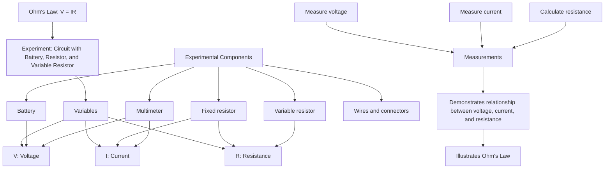

### What the Symbols Mean

- **V:** Voltage, measured in volts (V). It’s like the electrical “pressure” that pushes the current through the circuit.
- **I:** Current, measured in amperes (A). It’s how much electric charge is flowing.
- **R:** Resistance, measured in ohms (Ω). It shows how much the circuit resists the flow of electricity.

### Why This Equation is Important

- Ohm's Law is a fundamental principle in electronics and electrical engineering, describing the relationship between voltage, current, and resistance in an electric circuit. It is essential for designing and analyzing circuits, from simple household wiring to complex electronic systems.

### Historical Example

- Ohm's Law was formulated by Georg Simon Ohm, a German physicist, in 1827. Ohm's discovery was initially controversial but became a cornerstone of electrical theory, leading to advancements in technology, including the development of reliable electrical power systems.

### How to Explain to Kids

“Think of electricity like water flowing through a pipe. Voltage is like the pressure pushing the water, current is the amount of water flowing, and resistance is how hard it is for the water to get through. Ohm's Law helps us understand how they work together to make things like light bulbs glow.”

---

## 5. The Wave Equation

$$
\frac{\partial^2 u}{\partial t^2} = c^2 \frac{\partial^2 u}{\partial x^2}
$$

### Experiment: Waves on a Slinky

#### Materials Needed

- Slinky (metal or plastic)
- Measuring tape
- Stopwatch

#### Steps to Show the Math

1. **Set Up:** Stretch the slinky across a table or floor.
2. **Create a Wave:** Push one end of the slinky to create a wave and watch it travel down its length.
3. **Measure Wave Speed:** Use the stopwatch to measure the time it takes for the wave to travel to the other end and back. Measure the length of the slinky.
4. **Explanation:** Calculate the wave speed using $ \text{speed} = \frac{\text{distance}}{\text{time}} $. Discuss how tension in the slinky affects wave speed and relate this to the wave equation.

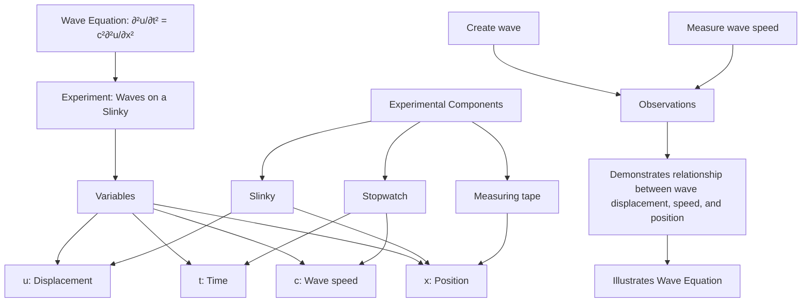

### What the Symbols Mean

- **$u$:** Displacement of the wave at a point, showing how far a point on the wave is from its resting position.
- **$\frac{\partial^2 u}{\partial t^2}$:** Acceleration of the wave's displacement over time.
- **$c$:** Wave speed, a constant showing how fast the wave moves.
- **$\frac{\partial^2 u}{\partial x^2}$:** Shows how the wave’s shape changes in space.

### Why This Equation is Important

- The wave equation is fundamental in physics, describing how waves move through different media. It's essential for understanding sound, light, and water waves, and has applications in engineering, music, and communications.

### Historical Example

- The wave equation was developed in the 18th century by Jean le Rond d'Alembert. It's crucial in fields ranging from acoustics to quantum mechanics, helping us understand everything from musical instruments to the behavior of particles.

### How to Explain to Kids

- “When you make a wave on a slinky, you can see it move back and forth. This equation tells us how fast and in what pattern the wave moves. It’s like the rule the wave follows as it travels.”

---

## 6. Euler's Formula for Complex Exponentials

$$
e^{ix} = \cos(x) + i\sin(x)
$$

### Experiment: Spinning Top or a Clock Face

#### Materials Needed

- Spinning top or a large clock face
- Paper and markers

#### Steps to Show the Math

1. **Spin the Top:** Spin the top and observe its circular motion.
2. **Draw a Circle:** On paper, draw a circle and mark points at different angles. Label them with cosine and sine values.
3. **Explanation:** Show how the spinning top's movement resembles cosine and sine functions. Explain Euler’s formula as a way to describe circular motion mathematically.

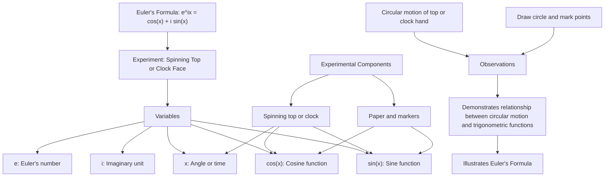

### What the Symbols Mean

- **$e$:** A special number (about 2.718) important in math.
- **$i$:** The imaginary unit, a special number that helps us describe things that can’t be represented by real numbers alone.
- **$x$:** The angle or time, showing how far along the circle we are.
- **$\cos(x)$ and $\sin(x)$:** Functions describing circular motion and waves.

### Why This Equation is Important

- Euler’s formula connects exponential functions with trigonometry, forming a bridge between algebra and geometry. It's widely used in engineering, physics, and complex number theory, especially in wave analysis and electrical engineering.

### Historical Example

- Introduced by Leonhard Euler in the 18th century, this formula is celebrated as one of the most beautiful in mathematics. It's fundamental in fields like signal processing and quantum mechanics, explaining phenomena such as waveforms and oscillations.

### How to Explain to Kids

- “When things spin around, like the hands of a clock, they can be described using cosine and sine. Euler’s formula is a neat way to combine these to describe spinning or circular movements.”

---

## 7. The Law of Universal Gravitation

$$
F = G\frac{m_1m_2}{r^2}
$$

### Experiment: Dropping Two Balls from the Same Height

#### Materials Needed

- Two balls of similar size but different masses, if possible
- Measuring tape
- Stopwatch (optional)

#### Steps to Show the Math

1. **Set Up:** Stand on a chair or step stool and hold both balls at the same height.
2. **Drop the Balls:** Release both balls simultaneously and observe that they hit the ground at nearly the same time.
3. **Measure Masses and Distance:** Discuss the masses of the balls and the distance from their centers to Earth's center, which is almost the same for both balls near the ground.
4. **Explanation:** Explain that gravity pulls harder on the more massive ball, but the more massive ball also needs proportionally more force to accelerate. Ignoring air resistance, both balls fall with the same acceleration near Earth's surface.

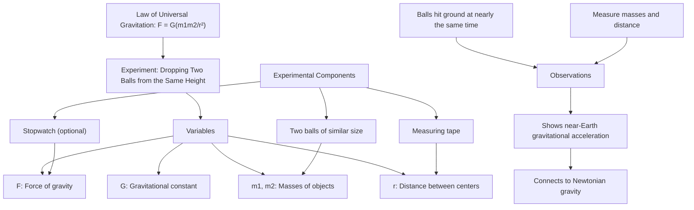

### What the Symbols Mean

- **$F$:** Force of gravity, measured in newtons (N). It’s how much pull there is between two objects.
- **$G$:** Gravitational constant, a fixed number that shows the strength of gravity.
- **$m_1$ and $m_2$:** Masses of the two objects, measured in kilograms (kg).
- **$r$:** Distance between the centers of the two objects, measured in meters (m).

### Why This Equation is Important

- Newton's Law of Universal Gravitation explains how objects are attracted to each other, a fundamental concept in physics. It explains phenomena from the falling of an apple to the motion of planets and the formation of galaxies.

### Historical Example

- Formulated by Isaac Newton in 1687, this law is often associated with the story of an apple falling from a tree. It provided the first quantitative explanation of the force that governs the orbits of planets, unifying terrestrial and celestial mechanics.

### How to Explain to Kids

- “Gravity pulls everything together, like when you drop a ball and it falls to the ground. This equation shows how the force depends on how heavy the objects are and how far apart they are.”

---

## 8. Navier-Stokes Equation (Simplified)

$$
\rho\left(\frac{\partial \mathbf{u}}{\partial t} + \mathbf{u} \cdot \nabla \mathbf{u}\right) = -\nabla p + \mu \nabla^2 \mathbf{u} + \mathbf{f}
$$

### Experiment: Stirring Water in a Bowl

#### Materials Needed

- Bowl of water
- Spoon or stirring stick
- Food coloring (optional)

#### Steps to Show the Math

1. **Set Up:** Fill the bowl with water. Add a drop of food coloring if you want to visualize movement.
2. **Stir the Water:** Use the spoon to stir the water and observe how it swirls and moves.
3. **Change Speed:** Stir faster and observe how the water’s movement changes.
4. **Explanation:** Explain that the equation predicts how the water moves. The faster you stir, the more movement is created, showing how motion changes with force.

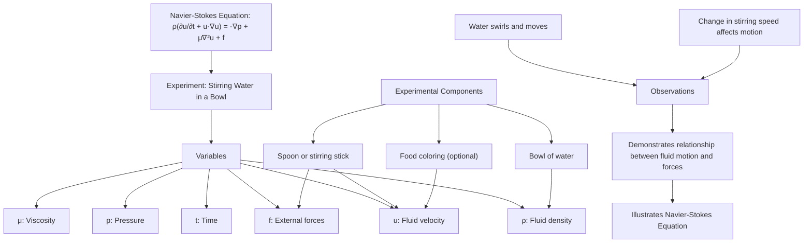

### What the Symbols Mean

- **$\rho$:** Density of the fluid, measured in kilograms per cubic meter (kg/m\(^3\)).
- **$\frac{\partial \mathbf{u}}{\partial t}$:** How the velocity of the fluid changes over time.
- **$\mathbf{u}$:** Velocity of the fluid, showing its speed and direction.
- **$-\nabla p$:** Pressure gradient, showing how pressure changes in space.
- **$\mu$:** Viscosity of the fluid, measuring how “thick” or “sticky” the fluid is.
- **$\nabla^2 \mathbf{u}$:** How velocity spreads out in the fluid.
- **$\mathbf{f}$:** External body force per unit volume, such as gravity written in the same units as the other force-density terms.

### Why This Equation is Important

- The Navier-Stokes equation is fundamental in fluid mechanics, helping us understand and predict the flow of liquids and gases. It's crucial in fields like aerodynamics, weather prediction, and even medicine (blood flow).

### Historical Example

- Derived in the 19th century by Claude-Louis Navier and George Gabriel Stokes, this equation is used to model complex fluid behaviors like ocean currents, weather patterns, and airflow over aircraft wings.

### How to Explain to Kids

- “When you stir water, it starts to move in patterns. This equation helps us predict how the water will flow and change when you stir it, like a set of instructions for water movement.”

---

## 9. The Normal Distribution (Gaussian Function)

$$
f(x) = \frac{1}{\sigma\sqrt{2\pi}} e^{-\frac{(x-\mu)^2}{2\sigma^2}}
$$

### Experiment: Dropping Beads Through a Peg Board

#### Materials Needed

- Small beads, beans, or marbles
- A peg board or cardboard with staggered pegs/pins
- A row of cups or bins at the bottom
- Chart paper and markers

#### Steps to Show the Math

1. **Set Up:** Stand the peg board upright and place cups or bins under the bottom edge.
2. **Drop the Beads:** Drop beads one at a time from the same spot at the top so each bead bounces left or right many times.
3. **Draw a Chart:** Count how many beads land in each cup and plot the counts to show a peak near the middle and fewer beads near the sides.
4. **Explanation:** Explain that many small random left-or-right changes often create a bell-shaped pattern. The peg-board result is discrete, while the normal distribution is a smooth model that often approximates this kind of pattern.

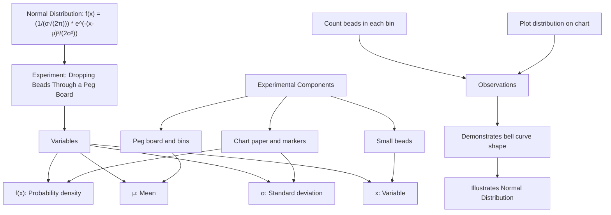

### What the Symbols Mean

- **$f(x)$:** Height of the probability-density curve at point $x$. For continuous data, probabilities come from the area under the curve over an interval, not from the height at one exact point.
- **$\mu$:** Mean or average, the center of the distribution.
- **$\sigma$:** Standard deviation, showing how spread out the data is.
- **$\sqrt{2\pi}$:** A constant that helps shape the curve.
- **$e$:** A special number in math, approximately 2.718, that helps with growth and decay patterns.

### Why This Equation is Important

- The normal distribution is essential in statistics and probability, describing how values tend to cluster around a mean. It's used in fields like psychology, economics, and natural sciences to analyze data and make predictions.

### Historical Example

- Studied by mathematicians including Abraham de Moivre, Pierre-Simon Laplace, and Carl Friedrich Gauss, this distribution became especially associated with measurement errors. It is also used to model many natural and social measurements, such as height, when the data are roughly bell-shaped.

### How to Explain to Kids

- “When beads bounce left and right many times, most end up near the middle, making a bell-shaped pile. The normal distribution is a smooth equation that helps describe that kind of pile shape.”

---

## 10. Bayes' Theorem

$$
P(A|B) = \frac{P(B|A)P(A)}{P(B)}
$$

### Experiment: Drawing Colored Candies from Two Bags

#### Materials Needed

- Two bags
- Candies of different colors (e.g., red and blue)
- Paper and markers for counting

#### Steps to Show the Math

1. **Set Up:** Place a different number of red and blue candies in each bag (e.g., bag 1 has 5 red, 3 blue; bag 2 has 2 red, 6 blue).
2. **Pick a Candy:** Secretly choose one bag, or choose a bag by flipping a coin, and have the child pick one candy without seeing the bag. Note its color.
3. **Count and Compare:** Count how common that color is in each bag and use this to estimate which bag it likely came from.
4. **Explanation:** Explain that Bayes’ theorem helps us make smart guesses based on the information we have (candy color) and what we know about each bag.

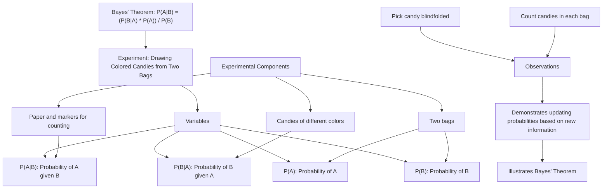

### What the Symbols Mean

- **$P(A|B)$:** Probability of event $A$ happening given that $B$ has happened.
- **$P(B|A)$:** Probability of $B$ happening given that $A$ has happened.
- **$P(A)$:** Probability of event $A$ happening on its own.
- **$P(B)$:** Probability of event $B$ happening on its own.

### Why This Equation is Important

- Bayes' theorem is fundamental in statistics and decision-making. It helps update the probability of a hypothesis based on new evidence, making it essential in fields like medicine, finance, and artificial intelligence.

### Historical Example

- Named after Thomas Bayes, an 18th-century statistician, this theorem is a foundation of Bayesian reasoning. Related probabilistic methods were important in wartime codebreaking, and today Bayesian ideas are crucial in machine learning and data science.

### How to Explain to Kids

- “If you know a candy is red, how likely is it that it came from bag 1? Bayes’ theorem helps us figure out things we don’t know by using what we do know. It’s like being a detective with clues.”

---

## 11. The Second Law of Thermodynamics

$$
\Delta S \geq 0
$$

### Experiment: Melting Ice in a Warm Drink

#### Materials Needed

- Ice cubes
- Warm drink (like tea or water)
- Thermometer

#### Steps to Show the Math

1. **Set Up:** Place an ice cube in a warm drink.
2. **Melt the Ice:** Watch the ice melt and observe how the temperature changes over time.
3. **Measure Temperature:** Use the thermometer to measure the temperature until it’s even throughout.
4. **Explanation:** Explain that as the ice melts, thermal energy spreads from the warm drink into the ice until the temperature becomes more even. The entropy of the combined drink-and-ice system plus its surroundings increases.

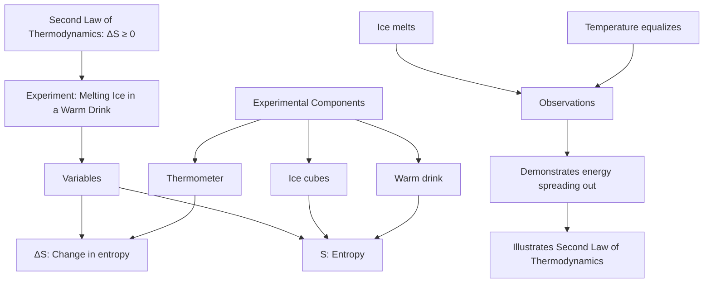

### What the Symbols Mean

- **$\Delta S$:** Change in entropy, a measure related to how energy is spread among possible microscopic arrangements.
- **$\geq 0$:** For an isolated system, entropy can stay the same in an ideal reversible process or increase in a real irreversible process.

### Why This Equation is Important

- The Second Law of Thermodynamics explains why some processes are irreversible and why energy naturally spreads out. It underpins concepts like energy efficiency and is crucial in understanding the arrow of time.

### Historical Example

- Formulated in the 19th century by Rudolf Clausius, this law helped explain why heat flows from hot to cold and laid the foundation for the study of energy and thermodynamics, impacting everything from engines to refrigerators.

### How to Explain to Kids

- “When ice melts in a drink, heat moves from the warm drink into the ice until everything gets closer to the same temperature. This law says energy tends to spread out unless something else does work to concentrate it.”

---

## 12. Planck's Photon Energy Relation

$$
E = h\nu
$$

### Experiment: Flashlight with Colored Filters

#### Materials Needed

- Flashlight
- Red and blue cellophane or colored filters
- White paper

#### Steps to Show the Math

1. **Set Up:** Shine the flashlight through the red filter onto a white piece of paper. Then do the same with the blue filter.
2. **Explain Energy:** Explain that an individual blue photon has more energy than an individual red photon because blue light has a higher frequency.
3. **Explanation:** Relate this to Planck's relation, showing how photon energy changes with color. Colored filters mostly block some wavelengths and let others through; they do not make the flashlight use a different amount of energy for each color.

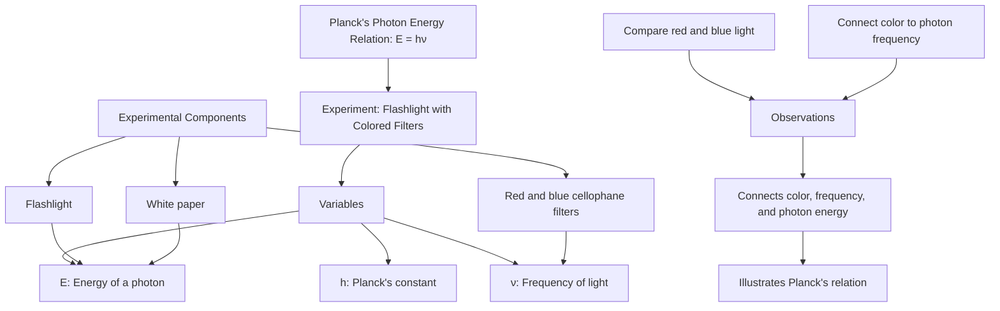

### What the Symbols Mean

- **$E$:** Energy of a photon, measured in joules (J).
- **$h$:** Planck’s constant, a fixed number ($6.626 \times 10^{-34} \text{J}\cdot\text{s}$) that relates energy and frequency.
- **$\nu$:** Frequency of the light, measured in hertz (Hz). It’s how many times the light wave cycles per second.

### Why This Equation is Important

- Planck's energy relation is one of the key ideas that led to quantum mechanics. It connects a photon's energy to its frequency and is fundamental in fields like quantum physics and modern electronics.

### Historical Example

- In 1900, Max Planck solved the blackbody radiation problem by proposing that energy exchange happens in discrete amounts proportional to frequency. The photon-energy form $E = h\nu$ became central to quantum theory soon afterward.

### How to Explain to Kids

- “Different colors of light have different amounts of energy. Blue light has more energy than red light because it has a higher frequency. This equation shows how the color of light relates to its energy.”

---

## 13. Coulomb's Law

$$
F = k_e \frac{q_1 q_2}{r^2}
$$

### Experiment: Rubbing Two Balloons with a Wool Sweater

#### Materials Needed

- Two balloons
- Wool sweater or cloth

#### Steps to Show the Math

1. **Rub and Charge:** Inflate the balloons and rub them with the wool sweater to charge them.
2. **Observe Repulsion:** Bring the balloons close to each other and observe how they repel.
3. **Explanation:** Explain that rubbing transfers electric charge, and Coulomb's law shows how like charges push away from each other. Rubbing more can increase the charge up to a point, but humidity and the materials affect how much charge builds up.

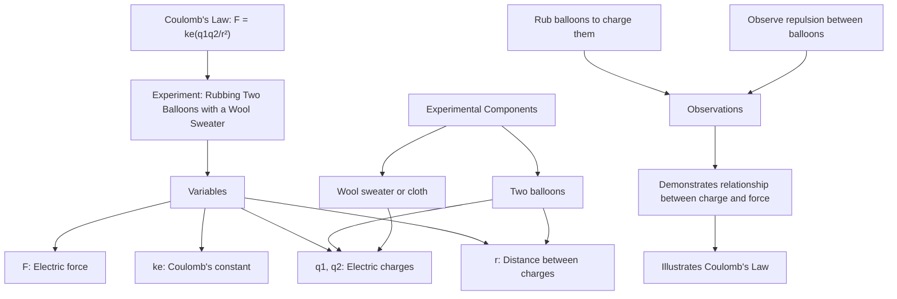

### What the Symbols Mean

- **$F$:** Force, measured in newtons (N). It’s how much push or pull there is between charges.
- **$k_e$:** Coulomb’s constant ($8.99 \times 10^9 \, \text{N·m}^2/\text{C}^2$), showing the strength of the electric force.
- **$q_1$ and $q_2$:** Electric charges of two objects, measured in coulombs (C).
- **$r$:** Distance between the centers of the two charges, measured in meters (m).

### Why This Equation is Important

- Coulomb's law is fundamental to electrostatics, explaining how electric charges interact. It's crucial for understanding electric fields, forces in atoms and molecules, and designing electronic devices.

### Historical Example

- Discovered by Charles-Augustin de Coulomb in the 18th century, this law was vital in the development of electromagnetism and understanding the structure of atoms.

### How to Explain to Kids

- “When you rub balloons, they get charged and push away from each other. This equation shows that the more you charge the balloons or the closer they are, the stronger the push or pull between them.”

---

## 14. The Logistic Growth Model

$$
\frac{dP}{dt} = rP\left(1 - \frac{P}{K}\right)
$$

### Experiment: Bean Population in a Limited Habitat

#### Materials Needed

- Dry beans, counters, or coins
- Bowl or tray to represent the habitat
- Paper and marker for a population graph

#### Steps to Show the Math

1. **Set Carrying Capacity:** Decide the habitat can hold at most 30 beans. This is $K$.
2. **Start Small:** Begin with 2 beans. This is the starting population $P$.
3. **Grow in Rounds:** Choose a growth rate such as $r = 0.5$. Each round, add about $\Delta P = rP(1 - P/K)$ beans, rounded to the nearest whole bean.
4. **Graph Growth:** Record the population after each round and draw the curve.
5. **Explanation:** Explain that population growth is fast when there are many resources, then slows as the habitat approaches its carrying capacity. This is a discrete simulation of the continuous logistic model.

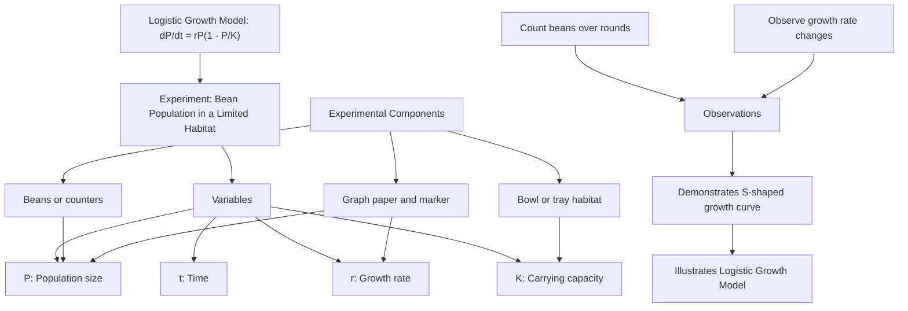

### What the Symbols Mean

- **$\frac{dP}{dt}$:** Rate of growth of the population over time.
- **$P$:** Population size at a given time.
- **$r$:** Growth rate, showing how quickly the population increases.
- **$K$:** Carrying capacity, the maximum population size the environment can sustain.

### Why This Equation is Important

- The logistic growth model describes how populations grow in a limited environment. It's used in biology, ecology, and resource management to predict how populations like bacteria, animals, or humans will grow and stabilize.

### Historical Example

- First described by Pierre François Verhulst in 1838, this model has been used to understand population dynamics, including human populations, and ecological impacts.

### How to Explain to Kids

- “A small population can grow quickly when there is plenty of room. Later, the habitat fills up, so growth slows and levels off. This equation shows how populations grow and slow down when space or resources run out.”

---

## 15. Kirchhoff's Current Law (KCL)

$$
\sum I_{in} = \sum I_{out}
$$

### Experiment: Using a Y-Shaped Water Pipe

#### Materials Needed

- Y-shaped pipe (like a garden hose splitter)
- Water source (faucet or water jug)
- Measuring cups

#### Steps to Show the Math

1. **Set Up:** Connect the Y-pipe to the water source. Use measuring cups at each end of the Y.
2. **Pour Water:** Turn on the faucet or pour water into the pipe.
3. **Measure Output:** Measure the amount of water coming out of each end of the Y-pipe.
4. **Explanation:** Show that the total water coming in equals the total water going out. This law is like making sure no water is lost when sharing it between two paths.

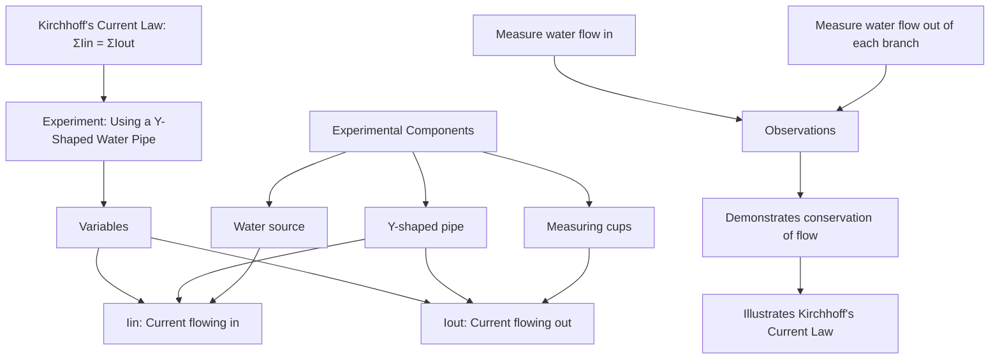

### What the Symbols Mean

- **$\sum I_{in}$:** Sum of all the electric currents coming into a junction.
- **$\sum I_{out}$:** Sum of all the electric currents going out of a junction.

### Why This Equation is Important

- Kirchhoff's Current Law is essential for understanding electrical circuits, ensuring that all current entering a junction also exits. It's fundamental in circuit design, analysis, and ensuring electrical safety.

### Historical Example

- Developed by Gustav Kirchhoff in the 19th century, this law is a cornerstone of electrical engineering. It’s used in designing circuits for everything from simple light switches to complex computer processors.

### How to Explain to Kids

- “If you pour water into a Y-shaped pipe, the amount of water going in equals the amount going out. This law is like a rule for how electric current flows in a circuit, making sure nothing is lost.”

---

## 16. Hooke's Law

$$
F = -kx
$$

### Experiment: Stretching a Spring

#### Materials Needed

- Spring (e.g., from a hardware store)
- Weights (like small bags of sand or objects of known mass)
- Ruler or measuring tape
- Hook for hanging

#### Steps to Show the Math

1. **Set Up:** Hang the spring from a hook or support.
2. **Measure Spring Length:** Measure the spring's natural (unstretched) length.
3. **Add Weights:** Attach a weight to the spring and measure how much the spring stretches.
4. **Calculate Force:** Calculate the applied force using the weight (mass times gravity).
5. **Explanation:** Show that the more weight you add, the more the spring stretches, demonstrating how the applied force is proportional to the stretch distance as long as the spring is not stretched past its elastic limit.

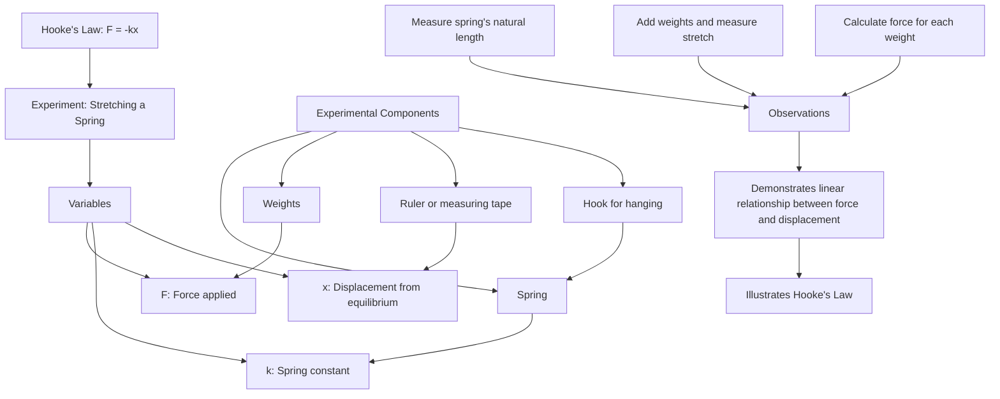

### What the Symbols Mean

- **$F$:** The spring's restoring force, measured in newtons (N). The negative sign means it points opposite the displacement. In the hanging-weight experiment, the applied force has magnitude $kx$.
- **$k$:** Spring constant, a measure of the stiffness of the spring, measured in newtons per meter (N/m).
- **$x$:** Displacement or stretch of the spring from its natural length, measured in meters (m).

### Why This Equation is Important

- Hooke's Law describes how elastic materials stretch and return to their original shape, which is fundamental in engineering, construction, and understanding natural phenomena like sound waves and earthquakes.

### Historical Example

- Formulated by Robert Hooke in the 17th century, this law helped understand elasticity and material properties. It’s critical in designing anything that relies on springs, from mattresses to vehicle suspensions.

### How to Explain to Kids

- “When you pull on a spring, it stretches. The harder you pull, the more it stretches. This equation shows how the amount of stretching depends on how hard you pull and how stiff the spring is.”

---

## 17. The Pythagorean Theorem

$$
a^2 + b^2 = c^2
$$

### Experiment: Using a Right Triangle

#### Materials Needed

- Ruler or measuring tape
- Right-angle triangle (e.g., cardboard cutout or triangle tool)
- Calculator (optional)

#### Steps to Show the Math

1. **Set Up:** Draw a right-angle triangle on paper or use a physical triangle.
2. **Measure Sides:** Measure the lengths of the two shorter sides (legs) of the triangle.
3. **Calculate Hypotenuse:** Use the Pythagorean theorem to calculate the length of the hypotenuse.
4. **Verification:** Measure the hypotenuse and compare it with the calculated value.
5. **Explanation:** Show how the sum of the squares of the two legs equals the square of the hypotenuse.

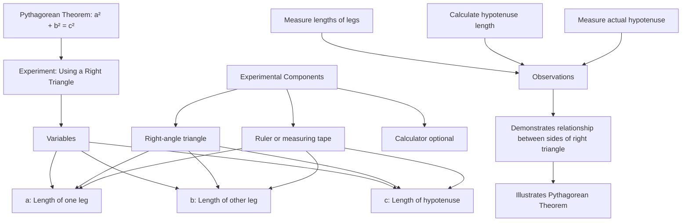

### What the Symbols Mean

- **$a$:** Length of one leg of the right triangle.
- **$b$:** Length of the other leg of the right triangle.
- **$c$:** Length of the hypotenuse (the side opposite the right angle).

### Why This Equation is Important

- The Pythagorean Theorem is a fundamental principle in geometry. It's used in various applications, from architecture and construction to navigation and computer graphics, to calculate distances and angles.

### Historical Example

- Named after the ancient Greek mathematician Pythagoras, this theorem has been known and used for thousands of years. It’s fundamental in Euclidean geometry and remains a cornerstone in mathematics.

### How to Explain to Kids

- “In a right triangle, the squares of the two shorter sides add up to the square of the longest side. This equation shows that if you know the lengths of the shorter sides, you can find the longest side.”

---

## 18. Snell's Law

$$
n_1\sin \theta_1 = n_2\sin \theta_2
$$

### Experiment: Light Bending in Water

#### Materials Needed

- Glass of water
- Flashlight or laser pointer
- Protractor
- White paper

#### Steps to Show the Math

1. **Set Up:** Place the glass of water on the white paper.
2. **Shine Light:** Shine the flashlight or laser pointer at an angle into the water.
3. **Observe Bending:** Observe how the light bends as it enters the water.
4. **Measure Angles:** Use a protractor to measure the angle of the incoming light and the angle inside the water.
5. **Explanation:** Use Snell's law to show how the refractive index changes when light moves between air and water, which changes the light's speed and direction.

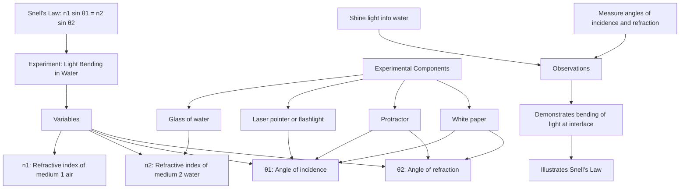

### What the Symbols Mean

- **$n_1$ and $n_2$:** Refractive indices of the two materials, such as air and water.
- **$\theta_1$:** Angle of incidence, the angle at which light hits the surface, measured from the normal line.
- **$\theta_2$:** Angle of refraction, the angle of light inside the water, measured from the normal line.
- The equivalent speed form is $\frac{\sin \theta_1}{\sin \theta_2} = \frac{v_1}{v_2}$ because refractive index is related to light speed by $n = c/v$.

### Why This Equation is Important

- Snell's Law describes how light bends when passing through different materials, which is essential for optics. It’s the foundation for lenses, glasses, cameras, and understanding phenomena like rainbows.

### Historical Example

- This law is named for Willebrord Snellius, who described it in the early 17th century, though earlier work by Ibn Sahl also captured the refraction relationship. It helped develop optical lenses and instruments, enabling advances in microscopy and astronomy.

### How to Explain to Kids

- “When light goes from air into water, it changes direction, just like how a car slows down and turns when it goes from a smooth road onto gravel. This equation shows how light bends when it moves between different materials.”

---

## 19. Bernoulli's Equation

$$
P + \frac{1}{2} \rho v^2 + \rho gh = \text{constant}
$$

### Experiment: Blowing Over Paper

#### Materials Needed

- Sheet of paper
- Drinking straw (optional)

#### Steps to Show the Math

1. **Set Up:** Hold a piece of paper by its edges.
2. **Blow Air:** Blow over the top of the paper and observe how it rises.
3. **Explanation:** Explain that fast-moving air over the paper can be associated with lower pressure, while the moving air also bends and pulls the paper upward. Bernoulli's equation describes an idealized part of this effect for steady, incompressible, low-viscosity flow along a streamline.

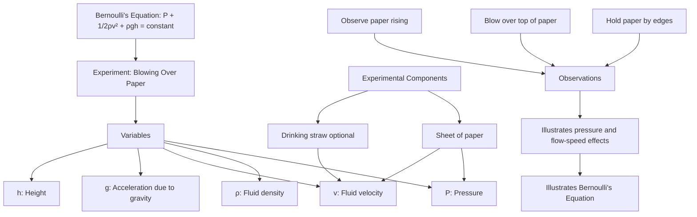

### What the Symbols Mean

- **$P$:** Pressure in the fluid, measured in pascals (Pa).
- **$\rho$:** Density of the fluid, measured in kilograms per cubic meter (kg/m\(^3\)).
- **$v$:** Speed of the fluid, measured in meters per second (m/s).
- **$g$:** Acceleration due to gravity, $9.8 \, \text{m/s}^2$.
- **$h$:** Height of the fluid above a reference point, measured in meters (m).

### Why This Equation is Important

- Bernoulli's Equation explains how pressure, speed, and height trade off in an ideal flowing fluid. It is fundamental in fluid dynamics and helps analyze systems such as nozzles, carburetors, and parts of aerodynamic lift, though real flows also involve viscosity, turbulence, and flow deflection.

### Historical Example

- Derived by Daniel Bernoulli in the 18th century, this principle has been vital in aerodynamics and engineering, contributing to analyses of lift in airplane wings and the functioning of many fluid systems.

### How to Explain to Kids

- “When you blow over a piece of paper, the air on top moves faster and creates less pressure, making the paper lift. This equation shows how fast-moving air can create low pressure.”

---

## 20. The Schrödinger Equation

$$
i\hbar\frac{\partial}{\partial t}\Psi = \hat{H}\Psi
$$

### Experiment: Waves in a Rope

#### Materials Needed

- Long rope or string
- Space to create waves

#### Steps to Show the Math

1. **Set Up:** Lay out a rope or string on the ground.
2. **Create Waves:** Move one end of the rope up and down to create waves.
3. **Observe Waves:** Notice the wave patterns and how they spread along the rope.
4. **Explanation:** Use the rope as an analogy for wave behavior, then explain that an electron's wave function is not a physical rope wave but a mathematical wave that describes probabilities.

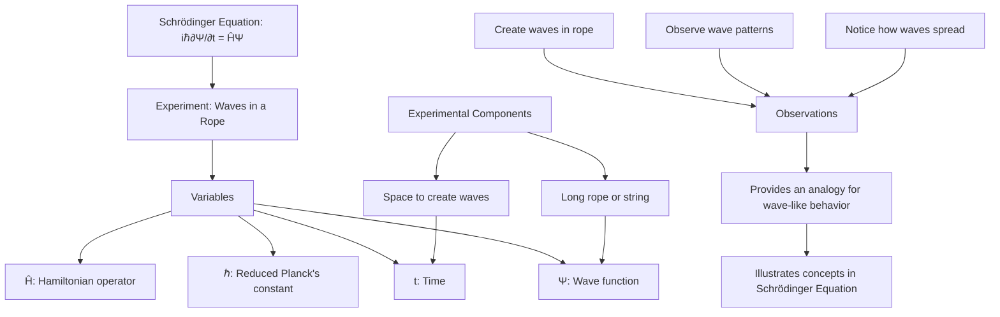

### What the Symbols Mean

- **$i$:** Imaginary unit, representing a phase difference.
- **$\hbar$:** Reduced Planck’s constant, a fundamental constant in quantum mechanics.
- **$\Psi$:** Wave function, describing the quantum state of a particle.
- **$\hat{H}$:** Hamiltonian operator, representing the total energy of the system.

### Why This Equation is Important

- The Schrödinger Equation is the cornerstone of quantum mechanics, describing how the quantum state of a system changes over time. It's fundamental in understanding the behavior of atoms, molecules, and subatomic particles.

### Historical Example

- Formulated by Erwin Schrödinger in 1926, this equation helped explain the behavior of electrons in atoms, leading to the development of quantum mechanics and revolutionizing physics and chemistry.

### How to Explain to Kids

- “Just like waves in a rope, tiny particles like electrons can have wave-like properties. This equation helps us understand the patterns of these waves and how they behave.”

---

## 21. Faraday's Law of Electromagnetic Induction

$$
\mathcal{E} = -N\frac{d\Phi_B}{dt}
$$

### Experiment: Moving a Magnet Near a Coil

#### Materials Needed

- Coil of wire
- Strong magnet
- Galvanometer or sensitive multimeter

#### Steps to Show the Math

1. **Set Up:** Connect the coil to the galvanometer or multimeter.
2. **Move Magnet:** Move the magnet in and out of the coil.
3. **Observe:** Watch the needle or reading on the meter change as the magnet moves.
4. **Explanation:** Explain that moving the magnet changes the magnetic flux through the coil, producing an electromotive force. A current flows when the circuit is closed through the meter.

```mermaid
graph TD
    A["Faraday's Law: ε = -N dΦB/dt"] --> B["Experiment: Moving a Magnet Near a Coil"]
    B --> C["Variables"]
    C --> D["ε: Induced electromotive force"]
    C --> E["ΦB: Magnetic flux"]
    C --> F["t: Time"]
    C --> X["N: Number of coil turns"]
    
    G["Experimental Components"] --> H["Coil of wire"]
    G --> I["Strong magnet"]
    G --> J["Galvanometer or multimeter"]
    
    H --> E
    I --> E
    J --> D
    
    K["Observations"]
    L["Move magnet in and out of coil"] --> K
    M["Observe meter reading changes"] --> K
    
    K --> N["Demonstrates induced current from changing magnetic field"]
    N --> O["Illustrates Faraday's Law"]
```

### What the Symbols Mean

- **$\mathcal{E}$:** Electromotive force (EMF), measured in volts (V).
- **$N$:** Number of turns in the coil.
- **$\Phi_B$:** Magnetic flux, representing the strength and extent of a magnetic field through a surface.
- **$t$:** Time, measured in seconds (s).

### Why This Equation is Important

- Faraday's Law explains how electric currents can be generated by changing magnetic fields, which is the principle behind electric generators and transformers, making it crucial for modern electricity generation and distribution.

### Historical Example

- Discovered by Michael Faraday in 1831, this law laid the foundation for electromagnetic theory. It enabled the invention of the electric generator and transformer, powering the modern world.

### How to Explain to Kids

- “When you move a magnet near a coil of wire, you create electricity! This equation shows how changing magnetic fields can make electric currents, like in a power generator.”

---

## 22. The Doppler Effect Equation

$$
f' = f \frac{v \pm v_o}{v \mp v_s}
$$

### Experiment: Whistle and Running

#### Materials Needed

- Whistle
- Space to run (e.g., a yard or park)

#### Steps to Show the Math

1. **Set Up:** Have someone stand still while another person runs past with a whistle.
2. **Blow Whistle:** The runner blows the whistle while moving past the stationary person.
3. **Observe Sound:** Notice how the pitch of the whistle changes as the runner approaches and then moves away.
4. **Explanation:** Explain that sound waves bunch up when the source and listener move toward each other and spread out when they move apart. Use the plus/minus signs according to the direction of motion.

```mermaid
graph TD
    A["Doppler Effect: f' = f(v ± vo)/(v ∓ vs)"] --> B["Experiment: Whistle and Running"]
    B --> C["Variables"]
    C --> D["f': Observed frequency"]
    C --> E["f: Emitted frequency"]
    C --> F["v: Speed of sound"]
    C --> G["vo: Speed of observer"]
    C --> H["vs: Speed of source"]
    
    I["Experimental Components"] --> J["Whistle"]
    I --> K["Open space to run"]
    
    J --> E
    K --> G
    K --> H
    
    L["Observations"]
    M["Blow whistle while running"] --> L
    N["Listen for pitch changes"] --> L
    
    L --> O["Demonstrates frequency change with relative motion"]
    O --> P["Illustrates Doppler Effect"]
```

### What the Symbols Mean

- **$f'$:** Observed frequency.
- **$f$:** Actual frequency emitted.
- **$v$:** Speed of sound in the medium.
- **$v_o$:** Speed of the observer.
- **$v_s$:** Speed of the source.
- The signs depend on whether the source and observer are moving toward each other or away from each other. For a stationary observer and a source moving toward them, $f' = f\frac{v}{v - v_s}$; moving away gives $f' = f\frac{v}{v + v_s}$.

### Why This Equation is Important

- The Doppler Effect explains how the frequency of a wave changes relative to an observer’s movement. This sound-wave version is used for everyday acoustics; related Doppler ideas are used in radar, astronomy, and medical imaging, with relativistic corrections needed for light at high speeds.

### Historical Example

- Described by Christian Doppler in 1842, this effect explains why a siren sounds higher-pitched as it approaches and lower-pitched as it moves away. It’s used in technologies like Doppler radar and ultrasound imaging.

### How to Explain to Kids

- “When a sound source moves towards you, like a car honking its horn, the sound waves get squished together, making the sound higher. When it moves away, the sound waves spread out, making the sound lower.”

---

## 23. The Heisenberg Uncertainty Principle

$$
\Delta x \cdot \Delta p \geq \frac{\hbar}{2}
$$

### Experiment: Throwing a Ball in the Dark

#### Materials Needed

- Soft ball
- Dark room
- Flashlight

#### Steps to Show the Math

1. **Set Up:** Turn off the lights to make the room dark.
2. **Throw Ball:** Have someone throw a soft ball in the dark and try to catch it.
3. **Use Flashlight:** Turn on the flashlight for a brief moment to see the ball.
4. **Explanation:** Use this as a rough analogy for incomplete information, then explain the important difference: the uncertainty principle is not just about a clumsy measurement. At the quantum scale, position and momentum are linked in a way that prevents both from having perfectly sharp values at the same time.

```mermaid
graph TD
    A["Heisenberg Uncertainty Principle: Δx · Δp ≥ ℏ/2"] --> B["Experiment: Throwing a Ball in the Dark"]
    B --> C["Variables"]
    C --> D["Δx: Uncertainty in position"]
    C --> E["Δp: Uncertainty in momentum"]
    C --> F["ℏ: Reduced Planck's constant"]
    
    G["Experimental Components"] --> H["Soft ball"]
    G --> I["Dark room"]
    G --> J["Flashlight"]
    
    H --> D
    H --> E
    I --> D
    J --> D
    
    K["Observations"]
    L["Throw ball in dark"] --> K
    M["Briefly illuminate with flashlight"] --> K
    N["Try to catch the ball"] --> K
    
    K --> O["Provides an analogy for position-momentum uncertainty"]
    O --> P["Illustrates Heisenberg Uncertainty Principle"]
```

### What the Symbols Mean

- **$\Delta x$:** Uncertainty in position, showing how well we know where something is.
- **$\Delta p$:** Uncertainty in momentum, showing how well we know how fast something is moving.
- **$\hbar$:** Reduced Planck’s constant, a fundamental constant in quantum mechanics.

### Why This Equation is Important

- The Heisenberg Uncertainty Principle shows the limits of measurement at the quantum scale, fundamentally changing our understanding of physics and reality. It's crucial in quantum mechanics, impacting fields like cryptography and nanotechnology.

### Historical Example

- Introduced by Werner Heisenberg in 1927, this principle challenged classical physics by showing that exact measurements of certain properties are impossible. It’s fundamental in the development of quantum mechanics.

### How to Explain to Kids

- “For tiny things like electrons, nature does not let position and momentum both be perfectly exact at the same time. If one is very sharp, the other must be more spread out. This equation shows that built-in limit.”

---

## 24. The Lorentz Transformation

$$
t' = \gamma \left( t - \frac{vx}{c^2} \right)
$$

### Experiment: Watching a Moving Object

#### Materials Needed

- Toy car
- Long track or surface
- Stopwatch

#### Steps to Show the Math

1. **Set Up:** Place the toy car at one end of the track.
2. **Move Car:** Push the car and start the stopwatch.
3. **Measure Time:** Measure how long it takes for the car to reach the other end.
4. **Explanation:** Use the toy car only as a way to discuss reference frames and motion. Relativistic time changes are far too small to measure with a toy car; they become important only at speeds close to the speed of light or in very precise clocks.

```mermaid
graph TD
    A["Lorentz Transformation: t' = γ(t - vx/c²)"] --> B["Experiment: Watching a Moving Object"]
    B --> C["Variables"]
    C --> D["t': Time in moving frame"]
    C --> E["t: Time in stationary frame"]
    C --> F["γ: Lorentz factor"]
    C --> G["v: Relative velocity"]
    C --> H["x: Position"]
    C --> I["c: Speed of light"]
    
    J["Experimental Components"] --> K["Toy car"]
    J --> L["Long track or surface"]
    J --> M["Stopwatch"]
    
    K --> G
    K --> H
    L --> H
    M --> D
    M --> E
    
    N["Observations"]
    O["Move car along track"] --> N
    P["Measure time of travel"] --> N
    
    N --> Q["Provides an analogy for reference frames"]
    Q --> R["Illustrates Lorentz Transformation"]
```

### What the Symbols Mean

- **$t'$:** Time observed in the moving frame.
- **$t$:** Time observed in the stationary frame.
- **$v$:** Speed of the moving object.
- **$x$:** Position in space.
- **$c$:** Speed of light.
- **$\gamma$:** Lorentz factor, $ \gamma = \frac{1}{\sqrt{1 - v^2/c^2}} $.

### Why This Equation is Important

- The Lorentz Transformation describes how time and space are linked and change at high speeds, forming the basis of Einstein’s theory of relativity. It's crucial in understanding time dilation and space travel at near-light speeds.

### Historical Example

- Developed by Hendrik Lorentz in the early 20th century, this transformation was essential for Einstein’s special relativity theory, which revolutionized our understanding of time, space, and the universe.

### How to Explain to Kids

- “If you could travel really fast, close to the speed of light, people who stay home and people who travel would not agree on exactly how much time passed. This equation helps translate time and position between those points of view.”

---

## 25. Fourier Transform

$$
F(k) = \int_{-\infty}^{\infty} f(x) e^{-2\pi ikx} dx
$$

### Experiment: Sound Waves and Frequencies

#### Materials Needed

- Tuning forks or a piano
- Microphone
- Computer with sound analysis software (e.g., Audacity)

#### Steps to Show the Math

1. **Set Up:** Open sound analysis software on the computer.
2. **Create Sound:** Strike a tuning fork or press a piano key.
3. **Analyze Sound:** Use the microphone to capture the sound and observe the wave patterns on the software.
4. **Explanation:** Explain how different sounds can be broken down into their frequencies, similar to how the Fourier transform breaks down complex signals into simple wave components.

```mermaid
graph TD
    A["Fourier Transform: F(k) = ∫f(x)e^-2πikx dx"] --> B["Experiment: Sound Waves and Frequencies"]
    B --> C["Variables"]
    C --> D["F(k): Fourier transform"]
    C --> E["f(x): Original function"]
    C --> F["k: Frequency"]
    C --> G["x: Time or space variable"]
    
    H["Experimental Components"] --> I["Tuning forks or piano"]
    H --> J["Microphone"]
    H --> K["Computer with sound analysis software"]
    
    I --> E
    J --> E
    K --> D
    K --> F
    
    L["Observations"]
    M["Create sound with instrument"] --> L
    N["Record and analyze sound"] --> L
    O["Observe frequency components"] --> L
    
    L --> P["Demonstrates decomposition of complex sounds into simple frequencies"]
    P --> Q["Illustrates Fourier Transform"]
```

### What the Symbols Mean

- **$F(k)$:** Fourier transform of function $f(x)$, representing how much of each frequency is present.
- **$f(x)$:** Original function or signal in the time domain.
- **$k$:** Frequency, showing how many cycles per unit time.
- **$e$:** Euler’s number, used in exponential functions.
- **$i$:** Imaginary unit, representing phase differences.

### Why This Equation is Important

- The Fourier Transform is fundamental in signal processing, allowing us to analyze and transform signals like sound, images, and data into their frequency components. It’s crucial in technology, from music to medical imaging.

### Historical Example

- Named after Jean-Baptiste Joseph Fourier, who introduced the concept in the early 19th century, the Fourier Transform is used in various fields, including music production, telecommunications, and image processing.

### How to Explain to Kids

- “Different sounds are made up of different pitches, like notes in a song. The Fourier transform is like a special tool that breaks down sounds into all the different notes that make them up.”

---

## 26. The Stefan-Boltzmann Law

$$
P = \epsilon\sigma A T^4
$$

### Experiment: Observing Heat from Different Light Bulbs

#### Materials Needed

- Different wattage light bulbs (e.g., 40W, 60W, 100W)
- Thermometer
- Cardboard box
- Timer

#### Steps to Show the Math

1. **Set Up:** Create a small enclosed space with the cardboard box, leaving one side open.
2. **Measure Temperature:** Place the thermometer inside the box and note the initial temperature.
3. **Heat with Light:** Place each light bulb at the same distance from the thermometer, one at a time, for a set duration (e.g., 5 minutes).
4. **Record Results:** Note the final temperature for each bulb and compare the temperature increases.
5. **Explanation:** Discuss that higher wattage bulbs usually warm the surroundings more, but this experiment measures total heating, including convection and conduction. The Stefan-Boltzmann law specifically describes thermal radiation from a surface; a closer comparison would use surfaces of the same area and emissivity at different absolute temperatures.

```mermaid
graph TD
    A["Stefan-Boltzmann Law: P = εσAT⁴"] --> B["Experiment: Observing Heat from Different Light Bulbs"]
    B --> C["Variables"]
    C --> D["P: Power radiated"]
    C --> E["σ: Stefan-Boltzmann constant"]
    C --> F["A: Surface area"]
    C --> G["T: Absolute temperature"]
    C --> X["ε: Emissivity"]
    
    H["Experimental Components"] --> I["Different wattage light bulbs"]
    H --> J["Thermometer"]
    H --> K["Cardboard box"]
    H --> L["Timer"]
    
    I --> D
    I --> G
    J --> G
    K --> F
    L --> D
    
    M["Observations"]
    N["Measure initial temperature"] --> M
    O["Heat with different bulbs"] --> M
    P["Record temperature changes"] --> M
    
    M --> Q["Shows heating trends; radiation law needs controlled surfaces"]
    Q --> R["Illustrates Stefan-Boltzmann Law"]
```

### What the Symbols Mean

- **$P$:** Power radiated, measured in watts (W).
- **$\epsilon$:** Emissivity, a number from 0 to 1 describing how efficiently a real surface radiates compared with an ideal blackbody.
- **$\sigma$:** Stefan-Boltzmann constant ($5.67 \times 10^{-8} \, \text{W}/\text{m}^2/\text{K}^4$).
- **$A$:** Surface area of the radiating body, measured in square meters (m²).
- **$T$:** Absolute temperature of the body, measured in kelvin (K).

### Why This Equation is Important

- The Stefan-Boltzmann Law describes how the total thermal radiation from an ideal blackbody, or approximately from a real body using emissivity, depends on absolute temperature. It's crucial in understanding heat transfer, stellar physics, and thermal radiation in engineering applications.

### Historical Example

- Discovered by Jožef Stefan in 1879 and derived theoretically by Ludwig Boltzmann in 1884, this law helped explain the relationship between a star's temperature and its energy output, revolutionizing our understanding of stellar evolution.

### How to Explain to Kids

- "Imagine you have three different strength heaters. The stronger the heater, the more it warms up the room. This equation shows that the hotter something gets, the much more heat it gives off, just like how a really hot star gives off way more light than a cooler one."

## 27. The Schrödinger Wave Equation (Time-Independent Form)

$$
-\frac{\hbar^2}{2m} \frac{d^2\psi}{dx^2} + V(x)\psi = E\psi
$$

### Experiment: Standing Waves on a String

#### Materials Needed

- Long, flexible string or rope
- Two fixed points to attach the string
- Vibration source (e.g., small motor or hand movement)

#### Steps to Show the Math

1. **Set Up:** Tie the string between two fixed points, leaving it slightly slack.
2. **Create Waves:** Vibrate one end of the string to create standing waves.
3. **Observe Patterns:** Notice how certain frequencies create stable patterns (nodes and antinodes).
4. **Explanation:** Use these standing wave patterns as an analogy for quantized states. Electron orbitals are not vibrating strings, but the allowed wave functions in atoms also come in specific patterns.

```mermaid
graph TD
    A["Schrödinger Wave Equation: -ℏ²/2m d²ψ/dx² + V(x)ψ = Eψ"] --> B["Experiment: Standing Waves on a String"]
    B --> C["Variables"]
    C --> D["ψ: Wave function"]
    C --> E["ℏ: Reduced Planck's constant"]
    C --> F["m: Mass of particle"]
    C --> G["V: Potential energy"]
    C --> H["E: Total energy"]
    
    I["Experimental Components"] --> J["Long, flexible string"]
    I --> K["Two fixed points"]
    I --> L["Vibration source"]
    
    J --> D
    K --> G
    L --> E
    L --> H
    
    M["Observations"]
    N["Create standing waves"] --> M
    O["Observe nodes and antinodes"] --> M
    
    M --> P["Provides an analogy for quantized modes"]
    P --> Q["Illustrates Schrödinger Wave Equation concepts"]
```

### What the Symbols Mean

- **$\hbar$:** Reduced Planck's constant.
- **$m$:** Mass of the particle.
- **$\psi$:** Wave function, describing the quantum state.
- **$V(x)$:** Potential energy as a function of position.
- **$E$:** Total energy of the system.

### Why This Equation is Important

- The Schrödinger Wave Equation is fundamental to quantum mechanics, describing the behavior of particles at the atomic scale. It's crucial for understanding atomic structure, chemical bonding, and the properties of materials.

### Historical Example

- Developed by Erwin Schrödinger in 1926, this equation provided a mathematical description of the wave behavior of matter, leading to the development of quantum mechanics and revolutionizing our understanding of the atomic world.

### How to Explain to Kids

- "Just like how a guitar string can only make certain notes when you pluck it, electrons in an atom can only exist in certain energy levels. This equation helps us understand the 'music' of atoms and why different elements have different properties."

## 28. The Nernst Equation

$$
E = E^\circ - \frac{RT}{nF} \ln Q
$$

### Experiment: Lemon Battery

#### Materials Needed

- Lemons
- Copper and zinc strips (or copper coins and galvanized nails)
- LED light or small digital voltmeter
- Wires with alligator clips
- Salt or baking soda solution for comparison

#### Steps to Show the Math

1. **Set Up:** Insert a copper strip and a zinc strip into a lemon.
2. **Measure Voltage:** Connect the voltmeter to the strips and measure the voltage.
3. **Change Conditions:** Compare the voltage with different lemon juice strengths or with a small amount of salt or baking soda solution. Keep the same metals and spacing as much as possible.
4. **Add Lemons:** Connect multiple lemons in series and observe that voltages add, which is useful but is a separate idea from the Nernst equation.
5. **Explanation:** Discuss how ion concentrations and reaction conditions affect the cell voltage, relating this to the Nernst equation.

```mermaid
graph TD
    A["Nernst Equation: E = E° - RT/nF ln(Q)"] --> B["Experiment: Lemon Battery"]
    B --> C["Variables"]
    C --> D["E: Cell potential"]
    C --> E["E°: Standard cell potential"]
    C --> F["R: Gas constant"]
    C --> G["T: Temperature"]
    C --> H["n: Number of electrons transferred"]
    C --> I["F: Faraday constant"]
    C --> J["Q: Reaction quotient"]
    
    K["Experimental Components"] --> L["Lemons"]
    K --> M["Copper and zinc strips"]
    K --> N["LED light or voltmeter"]
    K --> O["Wires with alligator clips"]
    K --> X["Salt or baking soda solution"]
    
    L --> J
    M --> D
    N --> D
    O --> D
    
    P["Observations"]
    Q["Measure voltage of single lemon"] --> P
    R["Change ion concentration"] --> P
    S["Observe voltage changes"] --> P
    
    P --> T["Demonstrates relationship between ion concentration and voltage"]
    T --> U["Illustrates Nernst Equation"]
```

### What the Symbols Mean

- **$E$:** Cell potential (voltage).
- **$E^\circ$:** Standard cell potential.
- **$R$:** Gas constant.
- **$T$:** Temperature in kelvin.
- **$n$:** Number of electrons transferred in the reaction.
- **$F$:** Faraday constant.
- **$Q$:** Reaction quotient (ratio of product to reactant concentrations).

### Why This Equation is Important

- The Nernst Equation is crucial in electrochemistry, describing how the voltage of an electrochemical cell depends on the concentrations of the substances involved. It's used in understanding battery technology, corrosion processes, and biological electron transfer reactions.

### Historical Example

- Developed by Walther Nernst in 1889, this equation has been fundamental in the development of pH meters, fuel cells, and in understanding biological processes like nerve signal transmission.

### How to Explain to Kids

- "Imagine you're making lemonade. The more lemon juice you add, the stronger it tastes. In a similar way, this equation shows how the strength of a battery changes based on what's inside it. It helps us understand how batteries work and how to make them better."

## 29. The Black-Scholes Equation

$$
\frac{\partial V}{\partial t} + \frac{1}{2}\sigma^2S^2\frac{\partial^2 V}{\partial S^2} + rS\frac{\partial V}{\partial S} - rV = 0
$$

### Experiment: Stock Market Simulation Game

#### Materials Needed

- Deck of cards
- Play money
- Graph paper
- Dice

#### Steps to Show the Math

1. **Set Up:** Assign one card suit to represent a stock and choose a starting price. Choose a fixed "strike price" for an option ticket.
2. **Simulate Market:** Use dice rolls to determine stock price changes over several rounds.
3. **Track an Option:** Give a player an option ticket: at the end, it is valuable only if the stock price is above the strike price.
4. **Graph Results:** Plot the stock price changes over time on graph paper and compare the final option payoff, $\max(S - K, 0)$, with different price paths.
5. **Explanation:** Discuss how the Black-Scholes equation estimates the fair value of stock options based on factors such as stock price, time, volatility, and interest rates. This game shows the ingredients qualitatively; it does not reproduce the full model or predict the future stock price directly.

```mermaid
graph TD
    A["Black-Scholes Equation: ∂V/∂t + 1/2σ²S²∂²V/∂S² + rS∂V/∂S - rV = 0"] --> B["Experiment: Stock Market Simulation Game"]
    B --> C["Variables"]
    C --> D["V: Option value"]
    C --> E["S: Stock price"]
    C --> F["t: Time"]
    C --> G["σ: Volatility"]
    C --> H["r: Risk-free rate"]
    
    I["Experimental Components"] --> J["Deck of cards"]
    I --> K["Play money"]
    I --> L["Graph paper"]
    I --> M["Dice"]
    
    J --> E
    K --> D
    L --> E
    L --> F
    M --> G
    
    N["Observations"]
    O["Simulate stock price changes"] --> N
    P["Track an option payoff"] --> N
    Q["Graph results over time"] --> N
    
    N --> R["Demonstrates factors affecting option prices"]
    R --> S["Illustrates Black-Scholes Equation concepts"]
```

### What the Symbols Mean

- **$V$:** Value of a financial derivative.
- **$S$:** Price of the underlying asset.
- **$t$:** Time.
- **$\sigma$:** Volatility of the underlying asset.
- **$r$:** Risk-free interest rate.

### Why This Equation is Important

- The Black-Scholes Equation is fundamental in financial mathematics, used for pricing options and other derivatives. It revolutionized the financial industry by providing a mathematical model for valuing complex financial instruments.

### Historical Example

- Developed by Fischer Black and Myron Scholes in the 1970s, with major related work by Robert Merton, this equation influenced the growth of derivatives markets. Scholes and Merton received the 1997 Sveriges Riksbank Prize in Economic Sciences in Memory of Alfred Nobel.

### How to Explain to Kids

- "Imagine you have a ticket that lets you buy a toy later for a fixed price. That ticket is more valuable if the toy's price might rise a lot. This equation helps grown-ups estimate the value of tickets like that for stocks."

## 30. Maxwell's Equations (Differential Form)

$$
\begin{align}
\nabla \cdot \mathbf{E} &= \frac{\rho}{\epsilon_0} \\
\nabla \cdot \mathbf{B} &= 0 \\
\nabla \times \mathbf{E} &= -\frac{\partial \mathbf{B}}{\partial t} \\
\nabla \times \mathbf{B} &= \mu_0\left(\mathbf{J} + \epsilon_0\frac{\partial \mathbf{E}}{\partial t}\right)
\end{align}
$$

### Experiment: Electromagnet and Compass

#### Materials Needed

- Insulated copper wire
- Battery
- Switch
- Small resistor or flashlight bulb to limit current
- Small compass or magnetic field sensor

#### Steps to Show the Math

1. **Set Up:** Wrap the insulated wire into a coil and connect it to the battery through a switch and a small resistor or flashlight bulb to limit current.
2. **Create Magnetic Field:** Place the compass near the coil and close the switch briefly to allow current to flow.
3. **Observe Electromagnetic Effect:** Watch the compass needle deflect when current flows and return when the switch opens.
4. **Explanation:** Discuss that electric current creates a magnetic field, one piece of Maxwell's equations. Electromagnetic waves require changing electric and magnetic fields, so this tabletop activity illustrates one ingredient rather than a full radio wave.

```mermaid
graph TD
    A["Maxwell's Equations Differential Form"] --> B["Experiment: Electromagnet and Compass"]
    B --> C["Variables"]
    C --> D["E: Electric field"]
    C --> E["B: Magnetic field"]
    C --> F["ρ: Charge density"]
    C --> G["J: Current density"]
    
    H["Experimental Components"] --> I["Insulated wire coil"]
    H --> J["Battery"]
    H --> K["Switch"]
    H --> L["Compass or magnetic field sensor"]
    H --> X["Current-limiting resistor or bulb"]
    
    I --> D
    I --> E
    J --> G
    K --> G
    L --> E
    
    M["Observations"]
    N["Create current in coil"] --> M
    O["Observe compass deflection near coil"] --> M
    
    M --> P["Shows current creating a magnetic field"]
    P --> Q["Illustrates Maxwell's Equations"]
```

### What the Symbols Mean

- **$\mathbf{E}$:** Electric field.
- **$\mathbf{B}$:** Magnetic field.
- **$\rho$:** Charge density.
- **$\epsilon_0$:** Permittivity of free space.
- **$\mu_0$:** Permeability of free space.
- **$\mathbf{J}$:** Current density.

### Why This Equation is Important

- Maxwell's Equations are fundamental to classical electromagnetism, describing how electric and magnetic fields interact and propagate. They form the basis for understanding electromagnetic waves, including light, radio waves, and X-rays.

### Historical Example

- Formulated by James Clerk Maxwell in the 1860s, these equations unified electricity, magnetism, and optics. They predicted the existence of electromagnetic waves, leading to the development of radio, television, and wireless communication technologies.

### How to Explain to Kids

- "Electricity and magnetism are connected. Moving electric charges can make magnetic fields, and changing magnetic fields can make electric fields. Maxwell's equations describe both parts of that connection, including light and radio waves."

---

## 31. The Conservation of Momentum

$$
m_1v_1 + m_2v_2 = m_1v_1' + m_2v_2'
$$

### Experiment: Rolling Marbles on a Smooth Surface

#### Materials Needed

- Two marbles of different sizes (or identical sizes)
- Smooth surface (like a tabletop)
- Measuring tape
- Stopwatch (optional)

#### Steps to Show the Math

1. **Set Up:** Place the two marbles on the smooth surface.
2. **Collide Marbles:** Gently roll one marble towards the other and observe what happens when they collide.
3. **Measure Speeds:** Use a stopwatch or estimate by observation how fast each marble moves before and after the collision.
4. **Explanation:** Discuss how the speed and direction of the marbles change, but their combined momentum remains approximately the same before and after the collision if outside forces such as friction are small. Treat the velocities as signed quantities, with direction included.

```mermaid
graph TD
    A["Conservation of Momentum: m1v1 + m2v2 = m1v1' + m2v2'"] --> B["Experiment: Rolling Marbles on a Smooth Surface"]
    B --> C["Variables"]
    C --> D["m1, m2: Masses of marbles"]
    C --> E["v1, v2: Initial velocities"]
    C --> F["v1', v2': Final velocities"]
    
    G["Experimental Components"] --> H["Two marbles of different sizes"]
    G --> I["Smooth surface table top"]
    G --> J["Measuring tape"]
    G --> K["Stopwatch optional"]
    
    H --> D
    I --> E
    I --> F
    J --> E
    J --> F
    K --> E
    K --> F
    
    L["Observations"]
    M["Roll one marble towards the other"] --> L
    N["Observe collision and resulting motion"] --> L
    O["Measure speeds before and after collision"] --> L
    
    L --> P["Illustrates approximate momentum conservation"]
    P --> Q["Illustrates Conservation of Momentum"]
```

### What the Symbols Mean

- **$m_1$ and $m_2$:** Masses of the two marbles.
- **$v_1$ and $v_2$:** Initial velocities of the two marbles before collision, including direction.
- **$v_1'$ and $v_2'$:** Velocities of the marbles after collision, including direction.

### Why This Equation is Important

- The conservation of momentum is a fundamental principle in physics, stating that the total momentum of a closed system remains constant unless acted upon by external forces. It's crucial for understanding interactions from car crashes to the motion of celestial bodies.

### Historical Example

- The concept dates back to Sir Isaac Newton's laws of motion, formulated in the 17th century. It underpins much of classical mechanics and is key in fields ranging from sports to space exploration.

### How to Explain to Kids

- “Imagine one marble hits another. They may both move differently after the hit, but if you add up their momentum, including direction, the total stays the same when no outside push gets involved.”

---

## 32. The Law of Refraction (Snell's Law)

$$
n_1\sin\theta_1 = n_2\sin\theta_2
$$

### Experiment: Laser Pointer in Water

#### Materials Needed

- Laser pointer
- Clear glass or acrylic tank
- Water
- Protractor

#### Steps to Show the Math

1. **Set Up:** Fill the clear tank with water and place it on a flat surface.
2. **Shine Laser:** Shine the laser pointer at an angle towards the surface of the water and observe how the light bends.
3. **Measure Angles:** Use a protractor to measure the angle of the laser in the air and the angle of the laser inside the water.
4. **Explanation:** Discuss how the change in medium (air to water) changes the light's speed and direction, which is described by Snell's law.

```mermaid
graph TD
    A["Snell's Law: n1 sin θ1 = n2 sin θ2"] --> B["Experiment: Laser Pointer in Water"]
    B --> C["Variables"]
    C --> D["n1, n2: Refractive indices"]
    C --> E["θ1: Angle of incidence"]
    C --> F["θ2: Angle of refraction"]
    
    G["Experimental Components"] --> H["Laser pointer"]
    G --> I["Clear glass or acrylic tank"]
    G --> J["Water"]
    G --> K["Protractor"]
    
    H --> E
    I --> D
    J --> D
    K --> E
    K --> F
    
    L["Observations"]
    M["Shine laser into water at an angle"] --> L
    N["Observe bending of light"] --> L
    O["Measure angles of incidence and refraction"] --> L
    
    L --> P["Demonstrates relationship between angles and refractive indices"]
    P --> Q["Illustrates Snell's Law"]
```

### What the Symbols Mean

- **$n_1$ and $n_2$:** Refractive indices of the first and second mediums (e.g., air and water).
- **$\theta_1$:** Angle of incidence, measured from the normal line to the surface.
- **$\theta_2$:** Angle of refraction, measured from the normal line to the surface.

### Why This Equation is Important

- Snell's Law is critical in optics, explaining how light bends when passing through different materials. It’s essential in designing lenses, glasses, cameras, and even understanding natural phenomena like rainbows.

### Historical Example

- Named for Willebrord Snellius's early-17th-century work, and with important earlier work by Ibn Sahl, Snell's law has been essential in the development of optical technologies and scientific understanding of light.

### How to Explain to Kids

- “When light goes from one thing to another, like from air to water, it bends. This bending depends on the stuff the light goes through. This equation shows how much light bends depending on what it's going through.”

---

## 33. The Continuity Equation in Fluid Dynamics

$$
A_1v_1 = A_2v_2
$$

### Experiment: Squeezing a Water Hose

#### Materials Needed

- Garden hose with a nozzle
- Water source
- Measuring tape or ruler

#### Steps to Show the Math

1. **Set Up:** Connect the hose to the water source and turn on the water at a steady rate.
2. **Observe Flow:** Observe how the water flows out of the hose without the nozzle.
3. **Squeeze Nozzle:** Squeeze the nozzle to reduce the opening size and observe how the speed of the water changes.
4. **Measure Flow Rate:** Measure the area of the hose opening and estimate the flow speed before and after squeezing the nozzle. You can also collect water for the same amount of time in a bucket to see whether the total flow rate changed.
5. **Explanation:** Explain that for steady, incompressible flow through a pipe with no leaks, a smaller cross-sectional area means higher speed at that point. A real hose nozzle may also change the total flow rate because it changes the pressure drop.

```mermaid
graph TD
    A["Continuity Equation: A1v1 = A2v2"] --> B["Experiment: Squeezing a Water Hose"]
    B --> C["Variables"]
    C --> D["A1, A2: Cross-sectional areas"]
    C --> E["v1, v2: Flow velocities"]
    
    F["Experimental Components"] --> G["Garden hose with nozzle"]
    F --> H["Water source"]
    F --> I["Measuring tape or ruler"]
    
    G --> D
    G --> E
    H --> E
    I --> D
    
    J["Observations"]
    K["Observe water flow without squeezing"] --> J
    L["Squeeze nozzle and observe flow change"] --> J
    M["Measure hose opening and flow speed"] --> J
    
    J --> N["Demonstrates inverse relationship between area and velocity"]
    N --> O["Illustrates Continuity Equation"]
```

### What the Symbols Mean

- **$A_1$ and $A_2$:** Cross-sectional areas of the hose opening before and after squeezing.
- **$v_1$ and $v_2$:** Flow velocities of the water before and after squeezing the nozzle.

### Why This Equation is Important

- The continuity equation is fundamental in fluid dynamics, describing conservation of mass. For steady, incompressible flow, it says the volume flow rate stays the same through different-sized sections of the same stream. It's essential in understanding how fluids behave in pipes, blood vessels, and natural environments like rivers.

### Historical Example

- Derived from the principles of conservation of mass, this equation is crucial in engineering applications, from designing plumbing systems to understanding the flow of air over airplane wings.

### How to Explain to Kids

- “When water flows through a hose and you make the end smaller, the water speeds up. This equation shows that if you squeeze one part of the hose, the water has to go faster to keep the same amount coming out.”

---

## 34. The Gravitational Potential Energy

$$
U = mgh
$$

### Experiment: Dropping Objects from Different Heights

#### Materials Needed

- Small objects (like balls or toys)
- Measuring tape or ruler
- Stopwatch (optional)

#### Steps to Show the Math

1. **Set Up:** Measure different heights (e.g., table height, chair height) and mark them.
2. **Drop Objects:** Drop objects from each height and observe the difference in how they fall.
3. **Calculate Potential Energy:** Use the formula to calculate the gravitational potential energy at different heights near Earth's surface.
4. **Explanation:** Explain how the higher the object is, the more gravitational potential energy it has, which converts into kinetic energy as it falls.

```mermaid
graph TD
    A["Gravitational Potential Energy: U = mgh"] --> B["Experiment: Dropping Objects from Different Heights"]
    B --> C["Variables"]
    C --> D["U: Gravitational potential energy"]
    C --> E["m: Mass of object"]
    C --> F["g: Acceleration due to gravity"]
    C --> G["h: Height above ground"]
    
    H["Experimental Components"] --> I["Small objects balls or toys"]
    H --> J["Measuring tape or ruler"]
    H --> K["Stopwatch optional"]
    
    I --> E
    J --> G
    K --> F
    
    L["Observations"]
    M["Measure different heights"] --> L
    N["Drop objects from each height"] --> L
    O["Observe falling speed"] --> L
    
    L --> P["Demonstrates energy increase with height"]
    P --> Q["Illustrates Gravitational Potential Energy"]
```

### What the Symbols Mean

- **$U$:** Gravitational potential energy, measured in joules (J).
- **$m$:** Mass of the object, measured in kilograms (kg).
- **$g$:** Acceleration due to gravity ($9.8 \, \text{m/s}^2$).
- **$h$:** Height above the chosen reference level, measured in meters (m). Near Earth's surface, this formula assumes $g$ is approximately constant.

### Why This Equation is Important

- Gravitational potential energy is a key concept in physics, describing the energy an object possesses due to its height. It’s crucial in understanding energy conservation, motion, and how forces interact in gravitational fields.

### Historical Example

- The concept of potential energy has roots in the work of early scientists like Galileo and Newton, who laid the groundwork for understanding energy transformations and conservation in classical mechanics.

### How to Explain to Kids

- “When you lift a ball up, you're giving it energy. The higher you lift it, the more energy it has. When you let go, it uses that energy to fall. This equation shows how much energy the ball has when it's up high.”

---

## 35. The Ideal Gas Law (Revisited with Temperature)

$$
PV = nRT
$$

### Experiment: Inflating a Balloon in Hot and Cold Water

#### Materials Needed

- Balloon
- Two bowls
- Hot water (from the tap)
- Ice water
- Thermometer

#### Steps to Show the Math

1. **Set Up:** Inflate a balloon slightly and tie it off.
2. **Place Balloon in Hot Water:** Put the balloon in a bowl of hot water and observe how it expands.
3. **Place Balloon in Ice Water:** Move the balloon to a bowl of ice water and observe how it contracts.
4. **Measure Temperature:** Use a thermometer to measure the temperature of the water in both bowls.
5. **Explanation:** Discuss how the gas inside the balloon expands when heated and contracts when cooled. This is an approximate constant-pressure example of the Ideal Gas Law, so temperature should be compared in kelvin rather than Celsius or Fahrenheit.

```mermaid
graph TD
    A["Ideal Gas Law: PV = nRT"] --> B["Experiment: Inflating a Balloon in Hot and Cold Water"]
    B --> C["Variables"]
    C --> D["P: Pressure"]
    C --> E["V: Volume"]
    C --> F["n: Number of moles of gas"]
    C --> G["R: Gas constant"]
    C --> H["T: Temperature"]
    
    I["Experimental Components"] --> J["Balloon"]
    I --> K["Two bowls"]
    I --> L["Hot water"]
    I --> M["Ice water"]
    I --> N["Thermometer"]
    
    J --> E
    K --> H
    L --> H
    M --> H
    N --> H
    
    O["Observations"]
    P["Inflate balloon slightly"] --> O
    Q["Place in hot water and observe expansion"] --> O
    R["Place in ice water and observe contraction"] --> O
    S["Measure water temperatures"] --> O
    
    O --> T["Illustrates temperature-volume relationship"]
    T --> U["Illustrates Ideal Gas Law"]
```

### What the Symbols Mean

- **$P$:** Pressure of the gas, measured in atmospheres (atm) or pascals (Pa).
- **$V$:** Volume of the gas, measured in liters (L) or cubic meters (m\(^3\)).
- **$n$:** Number of moles of gas, indicating the amount of gas present.
- **$R$:** Universal gas constant ($8.314 \, \text{J/(mol·K)}$).
- **$T$:** Temperature of the gas, measured in kelvin (K).

### Why This Equation is Important

- The Ideal Gas Law is a fundamental equation in chemistry and physics, describing the behavior of gases under different conditions. It’s used in fields ranging from meteorology to engineering to understand and predict gas behavior.

### Historical Example

- The Ideal Gas Law was developed over time with contributions from scientists like Robert Boyle, Jacques Charles, and Amedeo Avogadro, providing insights into the nature of gases and leading to advancements in science and industry.

### How to Explain to Kids

- “When you warm a flexible balloon, the air molecules move faster and the balloon can expand. When you cool it, the gas takes up less space. This equation shows how pressure, volume, amount of gas, and temperature fit together.”

---
